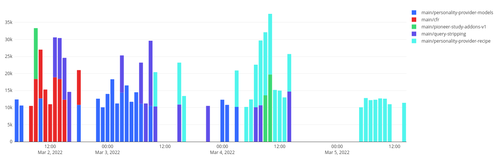

# Cache Bust on Signature Refresh

- Status: proposed
- Date: 2022-03-03

Tracking issue: https://github.com/mozilla/remote-settings/issues/186

## Context and Problem Statement

When clients synchronize their local state with the server, they pull the list of latest changes from the monitor/changes endpoint.

They iterate the list of collections, and use the provided timestamp in the `?_expected=` query param when fetching the changeset, in order to bust the CDN cache.

For example, given the following list of latest changes:

```
GET /buckets/monitor/collections/changes/records

{
  "data": [
    {
      "id": "eae22ba6-631d-fcab-fa53-8a7c5adb39a9",
      "last_modified": 1646297843179,
      "bucket": "security-state",
      "collection": "cert-revocations",
      "host": "firefox.settings.services.mozilla.com"
    },
    {
      "id": "e9f76a09-1c31-7dce-7c40-8abfbcfb244d",
      "last_modified": 1646261592246,
      "bucket": "main",
      "collection": "normandy-recipes-capabilities",
      "host": "firefox.settings.services.mozilla.com"
    },
    ...
  ]
}
```

The clients will pull from:

* `GET /buckets/security-state/collections/cert-revocations/changeset?_expected=1646297843179`
* `GET /buckets/security-state/collections/normandy-recipes-capabilities/changeset?_expected=1646261592246`

The CDN will cache the responses [aggressively](https://github.com/mozilla/remote-settings/blob/d1996490b2f5dc7f4d098c14f89dc86f3f568ca1/kinto-remote-settings/src/kinto_remote_settings/changes/views.py#L126-L138) for [1 hour](https://github.com/mozilla-services/cloudops-deployment/blob/b2ed06d77b6d84860b7bada0834c866fe37b289f/projects/kinto/puppet/modules/kinto/templates/kinto.ini.erb#L144).

Similarly, when a single collection is synchronized manually (or in the Rust client), we first fetch the list of latest changes, lookup the collection timestamp, and then fetch the changeset with the appropriate `?_expected` value.

The timestamps provided are the collection records timestamp, not the collections metadata timestamp. In other words, the timestamp won't be bumped if only the collection metadata is modified, and not its records data.

The collections content signatures rely on certificates that are relatively short-lived. Since some collections are not changed often enough, we regularly refresh collections signatures (using [a lambda](https://github.com/mozilla-services/remote-settings-lambdas/blob/master/commands/refresh_signature.py)) if it is older than 7 days.

This operation does not change the records, it only updates the signature fields. Namely, the certificate URL (x5u) and the signing value.

Because of this, the CDN cache is not busted on signature refresh. This lead to signature verification errors because clients could fetch an outdated response, like pointing to an expired certificate chain.

For example:

1. Changes are made on collection, data timestamp is bumped (`last_modified=42`)
1. Clients pull data from `/changeset?_expected=42`
1. CDN caches the response
1. Certificate expires
1. Signature is refreshed, the collection metadata is updated, data timestamp remains the same
1. Client queries monitor/changes endpoint, `last_modified=42`, pull changeset with `_expected=42`
1. CDN returns the cached changeset
1. Client pull expired certificate, signature fails
1. Client retries, clears local data, pulls full changeset again with `_expected=42`
1. Client signature fails again.

## Decision Drivers

In order to choose our solution we considered the following criteria:

- **Complexity**: Low → High: how much additional complexity
- **Impact**: Low → High: how big is the change on the whole service
- **Efforts**: Low → High: how much efforts are necessary
- **Rollout**: Slow → Fast: how fast can we roll out the fix

## Considered Options

1. Bump data timestamp on signature refresh
1. Use metadata timestamp as cache bust
1. Use metadata timestamp as cache bust only if signature fails

## Decision Outcome

Chosen option: option X because XXXX

Both options 1 and 2 have a significant impact.

Option 1 will cause more traffic, but globally absorbed by the CDN. It will force reverification of up-to-date data on clients, solving [bug 1640126](https://bugzilla.mozilla.org/show_bug.cgi?id=1640126). Rolling out is immediate and affect all versions.

Option 2 will double trafic on the origins, but have no impact on clients. Rollout will take time.

## Pros and Cons of the Options

### Option 0 - Do nothing

**Complexity**: N/A

**Impact**

High. For collections which don't ship data dumps, the synchronization process will fail and clear the local database (see [bug 1712108](https://bugzilla.mozilla.org/show_bug.cgi?id=1712108)). This can have a significant impact on users.



**Efforts**

Medium. We may have users reporting indirect misbehaviours because of this.

**Rollout**: N/A

### Option 1 - Bump data timestamp on signature refresh

This option consists in changing the server code when a request to refresh the collection signature is received.
Currently, when a signature is refreshed, since the data itself isn't modified, we only refresh the collection metadata timestamp.

With this option, we will bump the data timestamp, to pretend there was data change.

The timestamp in the monitor/changes response will thus be updated. The highest data timestamp in the list will then also be bumped, which will lead to a push notification being sent to all clients.

Clients will fetch the list of latest changed collections from monitor/changes, and since they will use the bumped timestamp in the `?_expected={}` query param, they will bust the CDN cache and obtain the latest version.

When iterating the list of collections and their respective data timestamp, they will compare their local data timestamp and the remote one, and will issue a synchronization if they differ.

Clients will fetch the changesets using the bumped timestamp:

`GET /buckets/main/collections/{cid}/changeset?_since={last-data-timestamp)&_expected={bumped-timestamp}`

The response will contain the refreshed signature, and an empty list of changes give that the data itself wasn't changed since the last synchronization.

**Complexity**

Low. The overall architecture would not be modified.

**Impact**

High.

Bumping the data timestamp on signature refresh will have a significant impact both on servers and on clients.

We refresh the signature of all collections that haven't been updated in the last 7 days. With this option, we will force synchronization on all clients for these collections every at most 7 days.

This will increase trafic on our servers, although the impact will be relatively low on the origins.

> Note: traffic on origin shouldn't be too affected. And we are very likely to refresh signatures of several collections are once, therefore grouping them in one push notification.

During synchronization, the clients will apply the empty list of changes (delta since last sync), and revalidate the signature of their local data.

This will have an impact on clients CPUs on every signature refresh. But this will indirectly fix [bug 1640126](https://bugzilla.mozilla.org/show_bug.cgi?id=1640126), which consists in verifying local data when up-to-date.

> Note: We could adjust the [behaviour of the lambda](https://github.com/mozilla-services/remote-settings-lambdas/blob/443117cb16cc9d720c59341c6c811e7bf127b289/commands/refresh_signature.py#L78-L93) to control the number of refreshed collections in one run.

**Efforts**

Low. This would be a one-liner in the `kinto-remote-settings` server plugin. Tagging and deploying is relatively cheap.

**Rollout**

Fast. The code change can be rolled out immediately. Effects would be visible after first signature refresh.

This would cover both Desktop and Rust clients.

And this option is easy to rollback.


### Option 2 - Use metadata timestamp as cache bust

This option would consist in adding a new field in the monitor/changes entries, providing the metadata timestamp.

```
GET /buckets/monitor/collections/changes/records

{
  "data": [
    {
      "id": "eae22ba6-631d-fcab-fa53-8a7c5adb39a9",
      "last_modified": 1646297843179,
      "metadata_timestamp": 1646293449944,
      "bucket": "security-state",
      "collection": "cert-revocations",
      "host": "firefox.settings.services.mozilla.com"
    },
    ...
  ]
}
```

The clients would use this `metadata_timestamp` field instead of `last_modified` as the value passed in the `?_expected=` query param to bust the cache.

**Complexity**

Low. The overall architecture would not be modified.

**Impact**

High. This will **multiply by 2 the trafic on our origin servers**, since we would have a population of clients that would bust the cache with one timestamp value, and the rest with another value.

This increase of trafic is likely to remain forever, given that legacy clients will keep on polling changes for a very long time. And only one distinct request on the CDN is enough to lead to a request on the origin server.

*However*, we could compensate the DB activity increase of this change by reducing the window of accepted sync deltas. Currently, we redirect all clients coming with a `?_since=` query parameter that is older than 30 days. We could reduce this to 15 days, which would divide the amount of DB hits by 2.

**Efforts**

Mid-Low. Adding the new field is a one-liner on the server. Tagging and deploying is relatively cheap.

This would require a change in both the Desktop and the Rust client.

**Rollout**

Slow.

The Rust client could be tagged and released immediately.

But we would have to ride trains for the Desktop client.

However, the change is reasonable and we would have a chance to be accepted in uplifts for Beta. Maybe Release too.

Note that the clients changes are relatively difficult to rollback.

```diff
--- a/services/settings/remote-settings.js
+++ b/services/settings/remote-settings.js
@@ -292,27 +292,27 @@ function remoteSettingsFunction() {
     gPrefs.setIntPref(PREF_SETTINGS_CLOCK_SKEW_SECONDS, clockDifference);
     const checkedServerTimeInSeconds = Math.round(serverTimeMillis / 1000);
     gPrefs.setIntPref(PREF_SETTINGS_LAST_UPDATE, checkedServerTimeInSeconds);

     // Iterate through the collections version info and initiate a synchronization
     // on the related remote settings clients.
     let firstError;
     for (const change of changes) {
-      const { bucket, collection, last_modified } = change;
+      const { bucket, collection, last_modified: dataTimestamp, metadata_timestamp: metadataTimestamp } = change;

       const client = await _client(bucket, collection);
       if (!client) {
         // This collection has no associated client (eg. preview, other platform...)
         continue;
       }
       // Start synchronization! It will be a no-op if the specified `lastModified` equals
       // the one in the local database.
       try {
-        await client.maybeSync(last_modified, { trigger });
+        await client.maybeSync(dataTimestamp, { trigger, metadataTimestamp });

         // Save last time this client was successfully synced.
         Services.prefs.setIntPref(
           client.lastCheckTimePref,
           checkedServerTimeInSeconds
         );
       } catch (e) {
         console.error(e);
```


```diff
--- a/services/settings/RemoteSettingsClient.jsm
+++ b/services/settings/RemoteSettingsClient.jsm
   /**
    * Synchronize the local database with the remote server, **only if necessary**.
    *
-   * @param {int}    expectedTimestamp the lastModified date (on the server) for the remote collection.
+   * @param {int}    dataTimestamp     the lastModified date (on the server) for the remote collection.
    *                                   This will be compared to the local timestamp, and will be used for
    *                                   cache busting if local data is out of date.
    * @param {Object} options           additional advanced options.
    * @param {bool}   options.loadDump  load initial dump from disk on first sync (default: true, unless
    *                                   `services.settings.load_dump` says otherwise).
    * @param {string} options.trigger   label to identify what triggered this sync (eg. ``"timer"``, default: `"manual"`)
    * @return {Promise}                 which rejects on sync or process failure.
    */
-  async maybeSync(expectedTimestamp, options = {}) {
+  async maybeSync(dataTimestamp, options = {}) {
     // Should the clients try to load JSON dump? (mainly disabled in tests)
-    const { loadDump = gLoadDump, trigger = "manual" } = options;
+    const { loadDump = gLoadDump, trigger = "manual", metadataTimestamp: expectedTimestamp } = options;

     // Make sure we don't run several synchronizations in parallel, mainly
     // in order to avoid race conditions in "sync" events listeners.
     if (this._syncRunning) {
       console.warn(`${this.identifier} sync already running`);
       return;
     }

@@ -576,26 +576,26 @@ class RemoteSettingsClient extends Event
         } catch (e) {
           // Report but go-on.
           Cu.reportError(e);
         }
       }
       let syncResult;
       try {
         // Is local timestamp up to date with the server?
-        if (expectedTimestamp == collectionLastModified) {
+        if (dataTimestamp == collectionLastModified) {
           console.debug(`${this.identifier} local data is up-to-date`);
           reportStatus = UptakeTelemetry.STATUS.UP_TO_DATE;


```


### Option 3 - Use metadata timestamp as cache bust only if signature fails

This option would globally be the same as *Option 2*, except that we would use the metadata timestamp as cache busting only if signature fails.

**Complexity**

Medium. Using different value of cache busting depending on the code path increases the complexity.

**Impact**

Low. When the clients retry after a signature failure, they fetch the whole changeset (without ``?_since=`` value). The CDN will cache the URL and the traffic on our origin servers won't be affected.

**Efforts**

Mid-Low. Same as *Option 2*.

**Rollout**

Slow. Same as *Option 2*.
