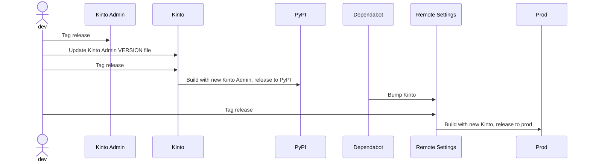
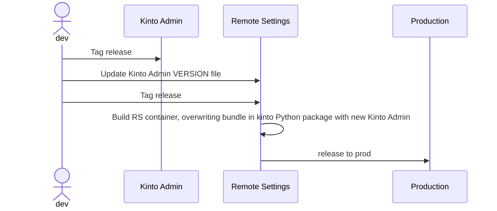
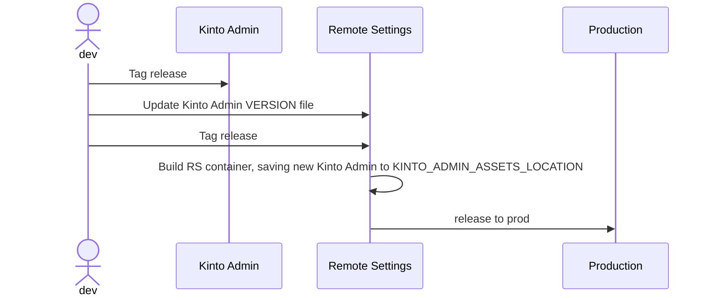

# Packaging: Upgrading Admin UI

* Status: proposed
* Deciders: mleplatre, gbeckley, acottner
* Date: Jan 9, 2024

## Context and Problem Statement

Currently, in order to deliver a change on the Kinto Admin UI to our Remote Settings production users, we need to go through the following steps:

1. Release the Kinto Admin package on NPM
2. Upgrade the Kinto Admin version embedded in Kinto ([source](https://github.com/Kinto/kinto/blob/master/kinto/plugins/admin/VERSION))
3. Tag a new Kinto version (Github Action publishes the package on Pypi)
4. Upgrade the Kinto version in Remote Settings
5. Release and deploy Remote Settings

Each step can take a certain amount of time, since they may involve pull-requests, review, and coordination.

We want to reduce the amount of time and efforts that are necessary for a change in the Kinto Admin UI repository to be deployed and available to our production users.

## Decision Drivers

In order to choose our solution we considered the following criteria:

- **?**: Low → High: <?>

## Considered Options

1. [Option 0 - Do nothing](#option-0---do-nothing)
1. [Option 1 - XXX](#option-1---XXX)

## Decision Outcome

Chosen option: Option 2 because it reduces the amount of steps significantly, but does not introduce any additional complexity. It is flexible and even optional.

## Pros and Cons of the Options

### Option 0 - Do nothing

See problem statement :)

### Option 1 - Overwrite Kinto Admin version in Kinto python package

With this solution, we introduce a command in the Remote Settings repository that:

1. pulls the Kinto Admin sources at a specific version ([source](https://github.com/Kinto/kinto/blob/master/scripts/build-kinto-admin.sh))
2. build the assets (Node)
3. overwrites the assets that are bundled with the Kinto package (ie. in `lib/python3.11/site-packages/kinto/plugins/admin/build/`) with the recent ones

This way the Kinto Admin version does not have to necessarily be the same as the one bundled in the Kinto Python package.

The releasing steps would become:

1. Release the Kinto Admin package on NPM
2. Upgrade the Kinto Admin version in Remote Settings
3. Release and deploy Remote Settings

**Pros**

- Simplicity
- Consistent packaging of the Remote Settings service in one container

**Cons**

- Ungraceful
- Coupling of between the location where Kinto expects the assets to be and the Remote Settings repository
- Potential source of confusion about deployed versions (official version in Kinto package and overwritten version in Remote Settings)

### Option 2 - Add option to override embedded Kinto Admin version

This solution is similar to *Option 1*, except that we introduce a new setting in Kinto to specify the location of the Kinto Admin assets instead of overwriting the files that are bundled ([sources](https://github.com/Kinto/kinto/blob/602ec49c80f033374aa1e957c8448e86d00ac9e8/kinto/plugins/admin/views.py#L13)).

In Remote Settings, we would set it to a local folder (eg. `KINTO_ADMIN_ASSETS_LOCATION=/app/kinto-admin-assets/`), and we let the Remote Settings serve the Admin UI as usual.

The releasing steps are the same as *Option 1*.

**Pros**

- Same as *Option 1*
- Elegant and flexible
- Offers our community users the ability to use their own forks of the Kinto Admin UI

**Cons**

- Potential source of confusion about deployed versions (official version in Kinto package and overwritten version in Remote Settings)

### Option 3 - Decouple Kinto Admin from container

With this solution, the Admin UI is not served by the Remote Settings container, but is hosted on a specific Cloud Storage bucket.

In order to maintain current URLs, some rewriting rules will have to be setup:

- `${SERVER}/v1/admin/` --> static files bucket
- `${SERVER}/v1/*` --> usual API endpoints

The releasing steps would become:

1. Release the Kinto Admin package on NPM
2. Deploy Kinto Admin in bucket

**Pros**

- Immediate deployment

**Cons**

- Complexity w.r.t deployment and setup
- The Remote Settings container would not necessarily bundle the same version as the one deployed in a specific environment
