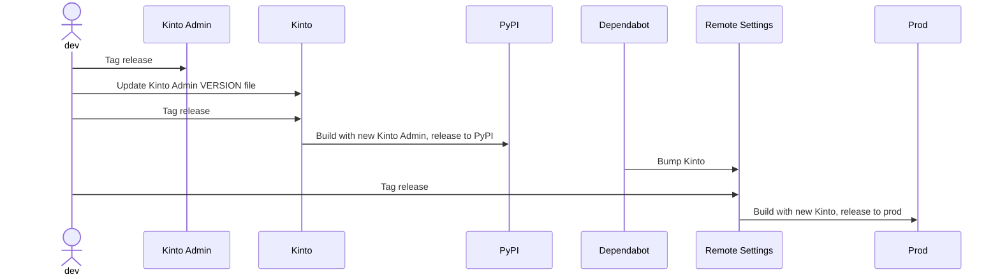
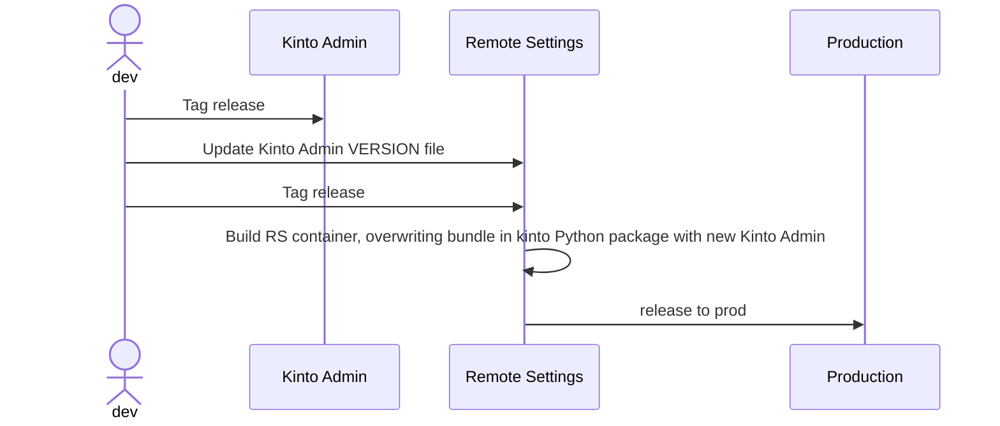
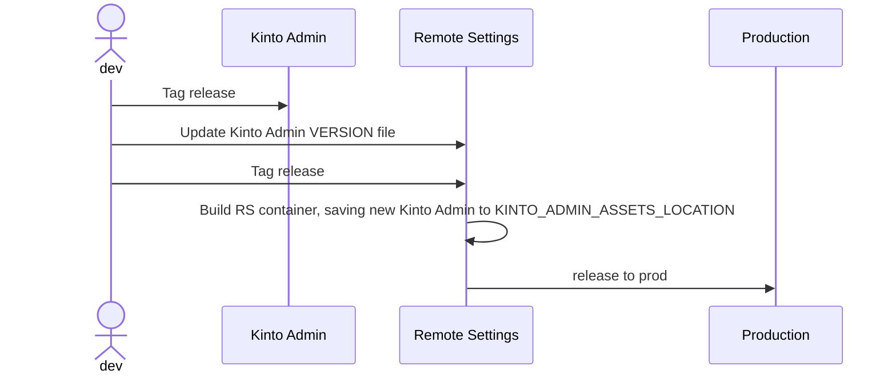
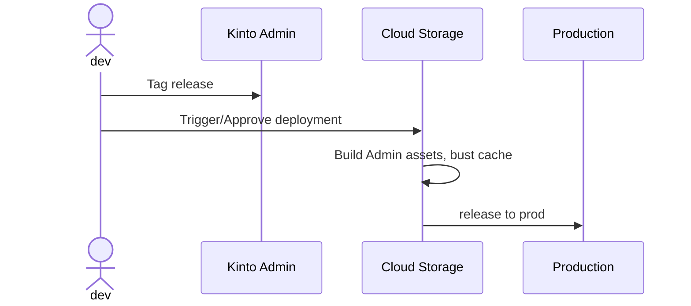
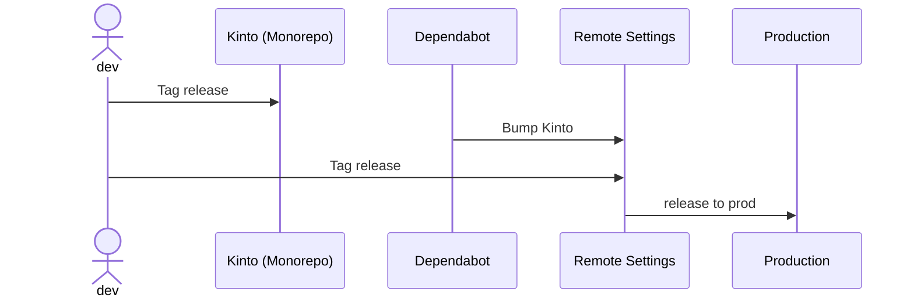

# Packaging: Upgrading Admin UI

* Status: [accepted](https://github.com/mozilla/remote-settings/pull/525)
* Deciders: mleplatre, gbeckley, acottner
* Date: Jan 9, 2024

## Context and Problem Statement

Currently, in order to deliver a change on the Kinto Admin UI to our Remote Settings production users, we need to go through the following steps:

1. Tag a new Kinto Admin version and create a Github release entry
2. Upgrade the Kinto Admin version embedded in Kinto ([source](https://github.com/Kinto/kinto/blob/master/kinto/plugins/admin/VERSION))
3. Tag a new Kinto version (since the recent Kinto 16.3.0, a Github Action publishes the package on Pypi)
4. Upgrade the Kinto version in Remote Settings
5. Release and deploy Remote Settings

Each step can take a certain amount of time, since they may involve pull-requests, review, and coordination.

We want to reduce the amount of time and efforts that are necessary for a change in the Kinto Admin UI repository to be deployed and available to our production users.

## Decision Drivers

In order to choose our solution we considered the following criteria:

- **Delivery Efforts**: Low → High: Amount of efforts or release steps.
- **Complexity**: Low → High
- **Version Consistency**: Low → High: Whether our users obtain a consistent experience between versions deployed on servers and pulled containers.

## Considered Options

1. [Option 0 - Do nothing](#option-0---do-nothing)
1. [Option 1 - Overwrite Kinto Admin version in Kinto python package](#option-1---overwrite-kinto-admin-version-in-kinto-python-package)
1. [Option 2 - Add option to override embedded Kinto Admin version](#option-2---add-option-to-override-embedded-kinto-admin-version)
1. [Option 3 - Decouple Kinto Admin from container](#option-3---decouple-kinto-admin-from-container)
1. [Option 4 - Merge Kinto and Kinto Admin repositories](#option-4---merge-kinto-and-kinto-admin-repositories)

## Decision Outcome

Chosen option: **Option 2** because it reduces the amount of steps significantly, but does not introduce any additional complexity. It is flexible and even optional.

## Pros and Cons of the Options

### Option 0 - Do nothing

See problem statement :)

**Delivery Efforts**: High. 3 release steps.

**Complexity**: Low. Nothing to do.

**Version Consistency**: High. Same version in Kinto and Remote Settings.

### Option 1 - Overwrite Kinto Admin version in Kinto python package

With this solution, we introduce a command in the Remote Settings repository that:

1. pulls the Kinto Admin sources at a specific version ([source](https://github.com/Kinto/kinto/blob/master/scripts/build-kinto-admin.sh))
2. builds the assets (Node)
3. overwrites the assets that are bundled with the Kinto package (ie. in `lib/python3.11/site-packages/kinto/plugins/admin/build/`) with the recent ones

This way the Kinto Admin version does not have to necessarily be the same as the one bundled in the Kinto Python package.

> Note: In the Remote Settings repository, we could also consider to automate the version upgrades using a dedicated action that would compare the specified local version with the latest upstream version.

The releasing steps would become:

1. Tag a new Kinto Admin version
2. Upgrade the Kinto Admin version in Remote Settings
3. Release and deploy Remote Settings

**Delivery Efforts**: Mid. 2 release steps.

**Complexity**: Low. But ungraceful because of the coupling between the location where Kinto expects the assets to be and the Remote Settings repository

**Version Consistency**: Mid-High. Users pulling the Remote Settings container would obtain the same UI version as the one deployed in a specific environment. The only version divergence for the UI version would be between Remote Settings and Kinto containers, which is acceptable.

### Option 2 - Add option to override embedded Kinto Admin version

This solution is similar to *Option 1*, except that we introduce a new setting in Kinto to specify the location of the Kinto Admin assets instead of overwriting the files that are bundled inside the Python package ([sources](https://github.com/Kinto/kinto/blob/602ec49c80f033374aa1e957c8448e86d00ac9e8/kinto/plugins/admin/views.py#L13)).

In Remote Settings, we would set it to a local folder (eg. `KINTO_ADMIN_ASSETS_LOCATION=/app/kinto-admin-assets/`), compile the Admin UI assets, copy them to the container at this location, and let the Remote Settings serve the Admin UI as usual.

The releasing steps are the same as *Option 1*.

**Pros**

- Same as *Option 1*
- Elegant and flexible
- Offers our community users the ability to use their own forks of the Kinto Admin UI

**Delivery Efforts**: Mid. 2 Same as *Option 1*.

**Complexity**: Low. Just replace a hard-coded path with a setting value.

**Version Consistency**: Mid-High. Same as *Option 1*.

### Option 3 - Decouple Kinto Admin from container

With this solution, the Admin UI is not served by the Remote Settings container, but is hosted on a specific Cloud Storage bucket.

In order to maintain current URLs, some rewriting rules will have to be setup:

- `${SERVER}/v1/admin/` --> static files bucket
- `${SERVER}/v1/*` --> usual API endpoints

The releasing steps would become:

1. Tag a new Kinto Admin version
2. Deploy Kinto Admin in bucket

**Delivery Efforts**: Low. Deployment could even occur automatically on tagging.

**Complexity**: Mid-High. Deployment configuration and setup would not be as obvious and straightforward as the current situation (assets served from the container).

**Version Consistency**: Low. Users pulling the Remote Settings container would not necessarily obtain the same UI version as the one deployed in a specific environment

### Option 4 - Merge Kinto and Kinto Admin repositories

If we would merge the two repositories into one monorepo, we would be able to release the changes in one step.

The releasing steps would become:

1. Tag a new Kinto version (embedding current Admin from main branch)
2. Upgrade the Kinto version in Remote Settings
3. Release and deploy Remote Settings

**Delivery Efforts**: Mid. 2 release steps.

**Complexity**: Mid. The Github Actions in the Kinto repository would become more complex since they would have to deal with both NPM and Python environments.

**Version Consistency**: High. The Kinto container would embed a specific Admin version that would eventually be exposed to our Remote Settings users.
