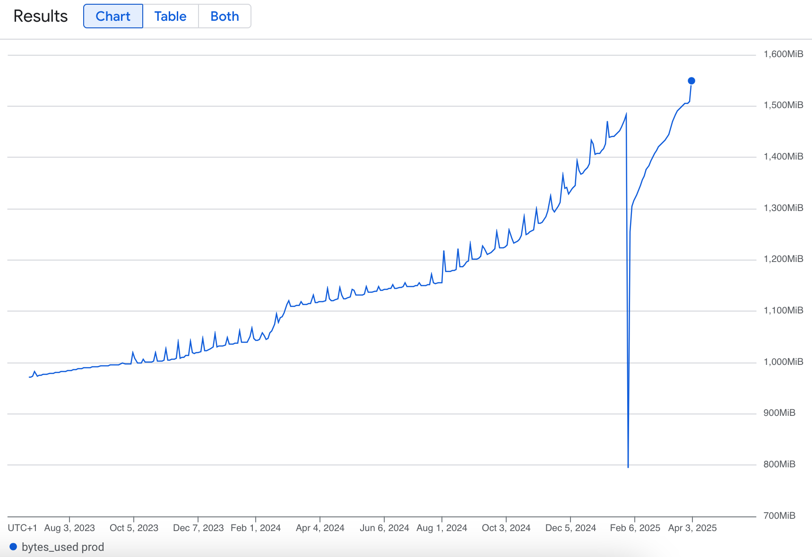

# Handle Growing Objects Table

* Status: accepted
* Deciders: mleplatre, acottner
* Date: Apr 3, 2025

## Context and Problem Statement

The Remote Settings storage implementation for PostgreSQL relies on a single table:

```
rs=# \d objects
                              Table "public.objects"
    Column     |            Type             | Collation | Nullable |   Default
---------------+-----------------------------+-----------+----------+-------------
 id            | text                        | C         | not null |
 parent_id     | text                        | C         | not null |
 resource_name | text                        | C         | not null |
 last_modified | timestamp without time zone |           | not null |
 data          | jsonb                       |           | not null | '{}'::jsonb
 deleted       | boolean                     |           | not null | false

```

* Buckets have `resource_name="bucket"` and `parent_id=""`
* Collections have `resource_name="collection"` and `parent_id="/buckets/{bid}"`
* Groups have `resource_name="group"` and `parent_id="/buckets/{bid}"`
* Records have `resource_name="record"` and `parent_id="/buckets/{bid}/collections/{cid}"`
* Deleted objects are kept in the table as tombstones with empty data and `deleted=true`
* The `kinto.plugins.history` creates an object with `resource_name="history"` for every write operation on the API

Over the years, this `objects` table grew significantly in production, reaching 840K+ rows in early 2025.




### Proportions

Because some use-cases generate a lot of changes, a huge proportion of it were history entries:

// TODO: do we have numbers before cleanup?

```
rs=# SELECT resource_name, COUNT(*) AS total FROM objects GROUP BY resource_name ORDER BY total DESC;
 resource_name | total
---------------+--------
 history       | 321089
 record        | 151911
               |   3767
 collection    |    346
 group         |    236
 bucket        |     26
(6 rows)
```

> Note: the objects with this ugly empty `resource_name` come from [kinto-attachment](https://github.com/Kinto/kinto-attachment/blob/e1ac9500adb66e318209ee0ed6d8fd9e937a2aff/src/kinto_attachment/utils.py#L190-L201) ☹️

In [mozilla/remote-settings#836](https://github.com/mozilla/remote-settings/issues/836) we introduced new routines that will
keep the history size under control.

However, still a good proportion of objects (80+% for records) are tombstones.
Deleting old ones is possible, but all clients doing partial synchronization from a state that is older than the cut date would face signature verification errors, and would have to retry synchronization from scratch.

```
rs=# SELECT resource_name, deleted, COUNT(*) AS count, ROUND(100.0 * COUNT(*) / SUM(COUNT(*)) OVER (PARTITION BY resource_name), 2) AS percentage FROM objects GROUP BY resource_name, deleted;

 resource_name | deleted | count  | percentage
---------------+---------+--------+------------
 ...
 record        | t       | 124846 |      82.18
```

Tombstones are growing significantly every year:

```
rs=# SELECT EXTRACT(YEAR FROM last_modified) AS year, COUNT(*) FROM objects WHERE deleted IS TRUE GROUP BY year ORDER BY 1 DESC;
 year | count
------+-------
 2025 | 39974
 2024 | 41205
 2023 |  8860
 2022 | 15962
 2021 |  5370
 2020 |  3969
 2019 |  4994
 2018 |  4396
 2017 |   240
 2016 |     2
 2015 |     1
(11 rows)
```

### Architecture

With the current architecture, our public read-only instances at the origin of our CDN point to the same database as our writer instances behind the VPN.

In comparison with write operations (a few per day), the database receive a tremendous amount of read queries (thousands per seconds).

Readers do not read objects like `history` or attachments links, and mostly read records and their tombstones.

The readers queries could be greatly optimized if they would handle a database limited to their dataset.

In this document, we explore possible solutions to overcome this limitation.

## Decision Drivers

In order to choose our solution we considered the following criteria:

- **Complexity**: Low → High: how complex is the solution
- **Cost of implementation**: Low → High: how much efforts does it represent
- **Cost of operation**: Low → High: how much does the solution cost to run
- **Future-resilience**: Low → High: how well it will handle future growth

## Considered Options

1. [Option 0 - Do nothing](#option-0---do-nothing)
1. [Option 1 - Trim objects automatically](#option-1---trim-objects-automatically)
1. [Option 2 - Partition the objects table by `resource_name`](#option-2---partition-the-objects-table-by-resource_name)
1. [Option 3 - Logical replicas for readers](#option-3---logical-replicas-for-readers)
1. [Option 4 - Full replicas for readers](#option-4---full-replicas-for-readers)

## Decision Outcome

Chosen option: We decided to go for [Option 4](#option-4---full-replicas-for-readers) as a first step. This solution does not require advanced Terraform skills, and brings us a lot of flexibility to adjust our database resources on writers (low frequency writes) and readers (constant reads).
We also have started [Option 1](#option-1---trim-objects-automatically) with [mozilla/remote-settings#836](https://github.com/mozilla/remote-settings/issues/836). And it does not mean we won't implement [Option 2](#option-2---partition-the-objects-table-by-resource_name) in [Kinto/kinto#3516](https://github.com/Kinto/kinto/pull/3516).


## Pros and Cons of the Options

### Option 0 - Do nothing

No change is made.

After trimming the history, and fixing [mozilla/remote-settings#830](https://github.com/mozilla/remote-settings/pull/830), our database CPU is now under 10%, even during spikes.

- **Complexity**: N/A
- **Cost of implementation**: N/A
- **Cost of operation**: Low (average over the years)
- **Future-resilience**: Medium. The records and their tombstones will continue to grow, and will require our attention at some point in the future.

### Option 1 - Trim objects automatically

- **Complexity**: Low
- **Cost of implementation**: Low
- **Cost of operation**: Medium-Low: clients with breaking synchronization could produce noise in our monitor tools
- **Future-resilience**: Medium. Trimming of tombstones would only be done by collection and by age in days. If the number of collections is growing and the frequency of deletions too, the tombstones will continue to grow.

### Option 2 - Partition the objects table by `resource_name`

The single `objects` table could be partitioned into several segments (see implementation in [kinto/kinto#3516](https://github.com/Kinto/kinto/pull/3516)).

In this case, the “parent“ `objects` table acts more like a “routing layer” for the partitions. It doesn't store any data itself.

Since most (all?) queries in Kinto include a `resource_name` filter, using partitions would immediately bring:

- better query performance (smaller sub-tables, parallel execution, ...)
- better write performance
- faster indexing

The objects triggers and indexes are applied to all partition tables automatically.

Since our storage implementation lives in *Kinto*, we would have to impose this partitioning to all users, even for small use-cases.

With the current code architecture, `kinto.core` is not “aware“ of possible values for `resource_name`.

Creating partitions for `history`, `bucket`, etc. would either break this separation of concern. In order to implement this cleanly, we could either:

* Add ability to plugins to run DB migrations ([Kinto/kinto#2391](https://github.com/Kinto/kinto/issues/2391)) and create the specific partitions that we need in `kinto-remote-settings`.

* Inject some settings values when executing `kinto.core` SQL migrations (eg. `settings.PARTITION_OBJECTS_BY=history,records`), with an empty list by default.

```sql
DO $$
DECLARE
    val text;
    partition_vals text[] := string_to_array('history,records', ',');
BEGIN
    CREATE TABLE objects_partition_default PARTITION OF objects DEFAULT;
    ALTER TABLE objects DISABLE TRIGGER tgr_objects_last_modified;

    FOREACH val IN ARRAY partition_vals LOOP
        EXECUTE format($sql$
            CREATE TABLE objects_partition_%I
            PARTITION OF objects
            FOR VALUES IN (%L)
        $sql$, val, val);
    END LOOP;

    ALTER TABLE objects ENABLE TRIGGER tgr_objects_last_modified;
END $$;
```

- **Complexity**: Medium-High. The database schema and migrations would become more complex.
- **Cost of implementation**: Medium-Low. Creating partitions is cheap, but maintaining the layer of abstraction of `kinto.core` will require us to introduce database migrations in plugins or complex PLSQL code.
- **Cost of operation**: Low. PostgreSQL handles everything for us.
- **Future-resilience**: Medium (Same as status quo since tombstones are not partitioned).


### Option 3 - Logical replicas for readers

With this solution, we deploy a new database to be used by readers.

PostgreSQL would copy data between the source database and this new one using a publisher/subscriber model, replicating data changes (INSERT/UPDATE/DELETE) at the table level, and we could select only the objects used by readers (buckets, collections, and records).

GCP CloudSQL does not support partial replication natively, but we could setup a secondary instance manually using Terraform and connect our readers to it.

Objects used by the writer, like accounts, history, attachments links, etc. would not be replicated.

Logical replication gives us a lot of control over read scaling and future flexibility. We would control the final dataset, for example exclude tombstones that are more than 2 years old.

Since performance on the writer is not critical, we could adjust the database resources according to their respective load (eg. reduce writers, increase readers RAM, etc.)
Any CPU spike on the reader database would not affect user experience.

- **Complexity**: Low. This is a classic read/write split architecture
- **Cost of implementation**: Medium. This requires some Terraform knowledge that may go beyond our team's, and we may have to rely on the SRE team to set it up correctly.
- **Cost of operation**: Medium-Low. We would have one more database to monitor. And although they don't have often, we would have to run schema migrations manually on the reader replica (could consider `pglogical` or tools like `Sqitch` to sync migrations with replication in mind)
- **Future-resilience**: Medium-High. We control the amount of data that are exposed to readers using queries.

### Option 4 - Full replicas for readers

We create a full replica for our readers. This is mostly built-in functionality in GCP CloudSQL, so we'd just need to enable the replica and update the reader's connection string.

This would also allow us to down-size our writer instances (probably 2-3x) to keep our costs at the same or lower levels.

These replicas would not have exactly the data they need as in option 3. But we don't have much data to optimize.

- **Complexity**: Low.
- **Cost of implementation**: Low. Small changes in terraform and helm.
- **Cost of operation**: Low. Costs should not increase and may decrease slightly since we can downscale the main instance.
- **Future-resilience**: Medium-High. We can independetly scale the reader replicas. Our workload is 99% read and 1% write, so the ability to scale the readers specifically is nice. We could also implement autoscaling in the future (if needed) with some alert listeners that would change cloud state.
