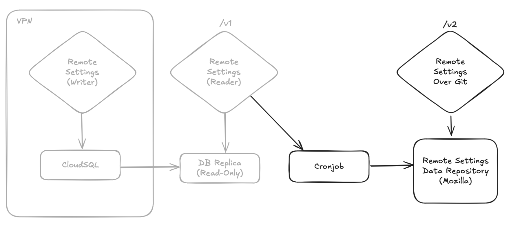
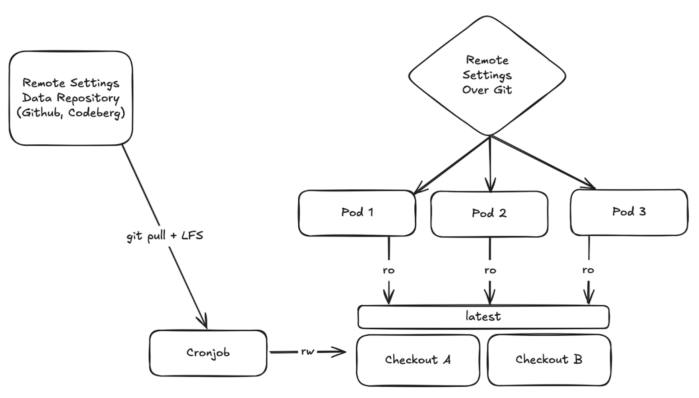

# Remote Settings Over Git

* Status: accepted
* Deciders: acottner, mleplatre, smarnach, wstuckey
* Date: Oct 17, 2025

## Context and Problem Statement

The Remote Settings service receives a tremendous amount of reads, for very few writes.

As we outlined it in our vision for a [RS next gen](https://docs.google.com/document/u/0/d/1Wt0CTGfU-xneuqS0-_Blr_paNgo5oBlICW7Pb1H8qWw/edit), replacing the current stack on top of PostgreSQL with static files would solve many of the limitations we face.

In the context of *Firefox Enterprise*, there seems to be a need to provide static files dumps of our server data.

As Remote Settings stakeholders, we believe there's a strong opportunity to align our long-term version with *Firefox Enterprise* and begin building reusable components without jeopardizing deadlines, while keeping the final solution simple.

This document outlines the proposed architecture for a short-term solution.

## Goals

* Fulfill the needs of *Firefox Enterprise*
* The same service implementation is deployed on-premise and in our infrastructure  
* Decouple readers from PostgreSQL to enable cost-effective horizontal scaling  
* Gradually replace Remote Settings components with features offered by Git

## Proposed Solution

- A **git repository** contains static exports of the data, leveraging version control features to track data changes  
- A **scheduled update job** turns the writer server data into git objects (branches, tags, folders, files) and pushes them to the git repository  
- A **service implementation** converts the Git internal object model back into Remote Settings data (buckets, collections, changesets, timestamps, partial diffs) and exposes all necessary endpoints for clients to consume

 ([diagram source](https://excalidraw.com/#json=dwAQlsgh83pZzn5DNi_xm,CefBFVhX1T7LKDFRRSC_3g))

*Note: there could be several instances of the cronjob in order to publish the data into several Git repositories (Gitlab, Codeberg, …)*

## Roadmap

Phase 1: Short term (Q4-2025)

* Create the data repository and deploy the cronjob in our infrastructure
* Deliver a Docker image with the new service implementation for integration with Firefox Enterprise Console
* Deploy the service in our infrastructure under [https://firefox.settings.services.mozilla.com/v2](https://firefox.settings.services.mozilla.com/v2)
* Implement Telescope checks to guarantee data consistency between current (/v1) and new instances (/v2)
* Monitor and consolidate the Git repository export and service

Phase 2: Mid term (Q3-2026)

* Clients gradually rely on this new git-based implementation (/v2 prefix ships in client code gradually)  
* Push server rely on /v2 for the broadcasts source of truth  
* Remote Settings public reader instances are scaled down  
* /v1 URLs are redirected to /v2  
* Remote Settings public readers are shutdown

Long term (?)

* Remote Settings becomes [entirely file-based](https://docs.google.com/document/u/0/d/1Wt0CTGfU-xneuqS0-_Blr_paNgo5oBlICW7Pb1H8qWw/edit)  
* Github UI replaces Kinto Admin UI  
* Kinto and PostgreSQL are shutdown

## Git Data Repository

The official repository is `mozilla/remote-settings-data` on Github, with the possibility to mirror it in EU hosted Gitlab or Codeberg.

This Git repository is the key component, and data modeling is critical for success. 

* Each bucket is a branch (`buckets/{bucket})`  
* Each collection is a folder with a `{collection}/metadata.json` file  
* Each record is a JSON file in the collection folder (`{collection}/{record-id}.json`)  
* Each attachment is a LFS pointer in the `attachments/` folder in the `common` branch   
* Each collection publication (user pushing new data) is a tag on the repository (`timestamps/{bucket}/{collection}/{timestamp}`)  
* Certificate chains (.pem) are stored in the `cert-chains/` folder on the `common` branch  
* The list of latest timestamps of all collection (monitor/changes) is the `monitor-changes.json` file in the `common` branch  
* The broadcast payload polled by the Push service is the `broadcasts.json` file in the `common` branch  
* The server info (root URL) is stored as `server-info.json` in the `common` branch

The repository is read only and only the update job has write permission.  
The STAGE data is stored in a separate repository (e.g. `remote-settings-data-stage`) with isolated permissions.

*Note: having a branch per bucket at this point helps us solve a very old limitation of Remote Settings that limits the versions of the same data to only two (preview and main). In our long term vision, consumers can point the client to as many versions of the data as they want, allowing engineers and QA to work on several sets of data changes in parallel.*

### About Attachments

Remote Settings attachments are referenced in records as relative URLs. In order to fetch them, the client concatenates the base URL obtained from the server root URL with the location field of the record.  
Attachments can weigh from a few kilobytes (e.g. intermediates .pem files) to a hundred of megabytes (translation models files). As of Aug 29, 2025, the total amount of attachments is about \~7GB.  
In Remote Settings, the attachments are not versioned and are unmutable. When a user updates the attachment of an existing record, a new file is published under a new randomly generated location.

Since we want the git repository to be self-contained, the attachments have to be part of the repository.   
However, most git hosting platforms have file limits (eg. 100MB per file and 5GB total on Github). [Git LFS](https://git-lfs.com/) seems an adequate solution to overcome this limitation:

* Files are stored as pointers on the git repository  
* Specific commands and [REST API](https://github.com/git-lfs/git-lfs/tree/main/docs/api) allow to add/fetch binary files  
* The LFS extension is mature and available on most git hosting services  
* Github Pro/Enterprise supports up to 4GB file size and 250GB total storage. Pricing is less clear on Gitlab, and Codeberg has free fair use[^1].

Attachments are common to several buckets (eg. bundles), and could thus live in the `common` branch.

### About Certificate Chains

The certificate chains are fetched by the client during signature verification. The absolute URLs to these files are part of the signature metadata.  
Since we want the git repository to be self-contained, the certificate chains have to be part of the repository, and be “stored” in the `common` branch.

However, since the client expects an absolute URL, the service (described below) would have to “rewrite” these URLs when exposing the collection metadata to the clients. For example, if the certificate chain URL was originally [https://content-signature-2.cdn.mozilla.net/2025-11-08-08-20-52.chain](https://content-signature-2.cdn.mozilla.net/g/chains/202402/remote-settings.content-signature.mozilla.org-2025-11-08-08-20-52.chain) it will have to become [https://firefox-enterprise.com/2025-11-08-08-20-52.chain](https://content-signature-2.cdn.mozilla.net/g/chains/202402/remote-settings.content-signature.mozilla.org-2025-11-08-08-20-52.chain). The content of the startup bundle (an archive of multiple collections changeset pulled by Firefox on startup) will also have to be rewritten to align chain URLs there too.

In parallel to this work, we are introducing [simple key agility features](https://github.com/mozilla/remote-settings/pull/1011) to Remote Settings which will help greatly for this. It will add support of relative URLs in signature payloads, with a base URL obtained from the server root URL like we do attachments. This will work for Firefox Enterprise since their Firefox builds will be based on recent versions.

For our goal to replace our reader instances with this new service in the mid-term, this is less problematic because we don’t need the service to be “self-contained”, clients can still rely on Autograph CDN and attachments be served from our GCS Storage and CDN.

## Scheduled Update Job

The update job iterates through the server endpoints (collections and records) and pulls the content if it has changed.

It commits and pushes changes to the configured repositories.

It is idempotent, resumes previous failed runs, and is triggered on the following events:

* Review is requested  
  * `buckets/*-preview` branches content will be updated  
* Changes are approved  
  * `buckets/main, buckets/security-state, buckets/blocklists` branches content will be updated  
* Signatures are refreshed  
  * latest metadata content of concerned folders will be updated

A specific case is made for `monitor/changes` which lists all collections' latest timestamps. It is stored as `monitor–changes.json` on the `common` branch.  
Same for `/__broadcasts__` which is stored `broadcasts.json` on the `common` branch.  
The root URL information is stored as `server-info.json` on the `common` branch.

The certificate chains are also exported in a dedicated folder `cert-chains/` on the `common` branch.

As described above, attachments can be managed using Git LFS. The job would be responsible for creating the LFS pointers, and store them in the `common` branch. Since LFS pointers are sha256+filesize, which are fields that are present on records with attachments, the job would not have to re-fetch the actual files from the CDN on each run to compare them.   
The job will upload the actual files to the configured LFS volumes using the [LFS REST API](https://github.com/git-lfs/git-lfs/tree/main/docs/api).

The job is responsible for trimming the old objects to keep the number of git internal objects under a certain limit. For example, remove old attachments from LFS volumes and old timestamps tags.

It would heavily rely on high-level libraries like `libgit2` in order to manipulate git internal objects, instead of relying on filesystem or [porcelain commands](https://git-scm.com/book/en/v2/Git-Internals-Plumbing-and-Porcelain). Thanks to the git data model, where objects ids are computed from objects content, the job will naturally only update content when necessary.

### Authentication

The job will authenticate on the remote repository using SSH keys. A dedicated [machine user](https://docs.github.com/en/authentication/connecting-to-github-with-ssh/managing-deploy-keys#machine-users) will be configured to have write access to the remote repository.

For the LFS REST API, a Personal Access Token will be created for this machine user and used by the job to authenticate.

## Service Implementation

The service implements the public read-only endpoints required by clients (see [clients specifications](https://remote-settings.readthedocs.io/en/latest/client-specifications.html#endpoints)).  
The endpoints that are not used by clients (eg. /batch, /records) won’t be implemented, hence the `/v2` prefix. 

The service is configured to read data from a folder where a git repository is checked out (`mozilla/remote-settings-data` by default). 

The repository was previously cloned (not bare), and the working directory has the `common` branch checked out, with the attachments fetched from LFS. The content of the other branches (i.e. specific buckets) is accessed via git internal objects.

When receiving a request to serve a changeset of a specific collection, it will:

- rely on the repository git object database (using a library like [`libgit2`](https://libgit2.org/))  
- use in-memory cache for everything  
- pull the changeset or attachment content matching from the right branch/tag/folder (details below)  
- serve the content using the right response status and headers (last-modified, cache-control, content-type, etc.)

We leverage libgit2’s caching mechanism, which will optimize our reads transparently. Note that without attachments, the whole Remote Settings server content easily fits in memory (36MB as of Sep 2, 2025).

### Clone Folder

The repository is checked out in a folder, and the reader instances read data from it.

In this section we expose the different approaches to manage the checkout folder.

**Option A) Replicated**  
With this approach, each container has its own clone, and reads git objects and files from local disk.

Pros

- Simplicity  
- Performance

Cons

- Data has to be cloned and LFS files fetched on each instance creation (ie. during upscaling)  
- Disk space  
- Git LFS quota consumed by N instances  
- Possible inconsistencies between different instances (e.g. client obtains list of timestamps from one instance and try to fetch a changeset that is still unknown from another instance) 

**Option B) Shared**  
With this approach, the repository is cloned on a shared volume that is mounted on each container.

Pros

- Consistency: same data for all instances  
- Efficiency: Content is fetched only once

Cons

- Some overhead for reads (compared to local files)  
- Requires some orchestration for the repository update, or an external job (see below), in order to prevent concurrent `git pull` from the different instances

**We chose Option B – the shared volume approach –** because the downsides of local folders outweigh their benefits.

*Example of LFS error when too many LFS fetch are issued:*

```
batch response: This repository exceeded its LFS budget. The account responsible for the budget should increase it to restore access.
Failed to fetch some objects from 'https://github.com/{org}/remote-settings-data.git/info/lfs'
```

The local update of a git repository (`git pull`) is not “atomic”: the changes are pulled from the server and applied iteratively. Additionally, pulling the LFS files can only be done as a separate step (`git lfs pull`) and usually takes quite some time.

In order to prevent the reader service from serving requests from an inconsistent state, we have to find a solution to make this operation atomic.  
For this we will use two folders and a filesystem link

- `/mnt/data/A`  
- `/mnt/data/B`  
- `/mnt/data/latest -> /mnt/data/B`

The update operation will consist in running the following steps:

1. Pick the folder that is not pointed by the hardlink (eg. compare underlying folders)  
2. Run `git pull` \+ `git lfs pull` in that folder  
3. Run validation (checksum, fsck)  
4. Repoint `latest` to the updated folder  
5. *Readers will now serve the new data*  
6. Run  `git pull` \+ `git lfs pull` in the other folder too

### Clone Folder Updates

The checked out folder has to be maintained up-to-date for the instances. In this section we expose the different approaches to manage the updates.

Note: since the repository needs to be checked out for the git reader service, we use `git pull && git lfs pull`, and not just `git fetch`.

**Option A) Cronjob (eg. every 5 minutes)**

On each execution, a `git pull + git lfs pull` is executed. If no changes were published since the last run, the job exits early. Otherwise it checks out the latest changes and pulls LFS files.

Pros

- Simple  
- Decoupled from service implementation  
- Service containers can mount the Git folder as read-only

Cons

- Latency between two runs  
- Runs a git pull every 5 minutes even if no changes are made

**Option B) Service Endpoint** (`/__fetch__`)

A service endpoint that executes the Git update procedure.

Pros

- Can be used as Github webhook  
- Code along service code

Cons

- Requires git folder to be mounted with write permission on the server containers  
- Requires all containers to have SSH materials required to pull from source repository  
- Requires endpoint to be protected from public internet  
- Requires mechanism to prevent multiple containers to update concurrently

**We choose Option A \- Cronjob** since the fetch request is very cheap when no updates are available, at least as a first simple implementation.



The `remote-settings-git-reader` Docker container has the following entry points:

- `init`: creates the initial folder structure and clones from specified remote  
- `update`: executes the git pull and atomic update of folders  
- `web`: runs the Web application

A deployment thus consists in:

1. An first (and once) execution of `init`  
2. A cronjob that executes `update` (mounts the folder r/w and has SSH keys)  
3. Pods that runs the `web` app (mounts the folder r/o)

### Endpoints

*Note: The `/v2` prefix highlights the fact that the API is not backward compatible with `/v1`. However all Firefox clients [\> 77 (2020)](https://bugzilla.mozilla.org/show_bug.cgi?id=1620186) will be supported (ESR is 115), as well as the Rust application services clients.* 

It follows this straightforward mapping of endpoints:

`/v2/`

- Serves metadata necessary for attachments download (`attachments.base_url`)  
- Some information about the source git repository (current head commit and date)  
- Some fields (project\_name, etc.) will be read from `server-info.json` of the `common` branch

`/v2/buckets/<bucket>/collections/<name>/changeset?_expected=<val>` 

- Scans the content of the `collections/{name}/`folder from the `{bucket}` branch and assembles the list of records and collection metadata into a `changeset` JSON payload to be served.  
- Opens collection metadata at  `collections/{name}/metadata.json`, modify the `x5u` field to rewrite the URL and change the domain to the current one  
- If branch `{bucket}` or `{name}` folder does not exist, then a 404 is returned  
- The expected `{val}` is mandatory but only serves as CDN cache-busting and is ignored

`/v2/buckets/<bucket>/collections/<name>/changeset?_since={T}` 

- Looks up the tag `refs/tags/timestamps/{T}`, and the load the previous version of this changeset  
- Loads the changeset of the `{bucket}` branch HEAD  
- And computes the diff between the two ([the code is trivial](https://github.com/Kinto/kinto-http.py/blob/29d95f8d778999cfa5c3299c9300842e8578a937/src/kinto_http/utils.py#L98-L113)) in order to serve tombstones and omit identical records.  
- If tag `{T}` does not exist, then an error is logged and the full latest is returned  
- If `{T}` is not an integer between quotes (e.g. `”1756286138497”`) then a 400 error is returned

`/v2/buckets/monitor/collections/changes/changeset`

- A specific case that serves the content of `monitor-changes.json` of the `common` branch.   
- This endpoint is able to filter entries based on `_since={T}` timestamp, and/or collection and bucket `?bucket={bid}&collection={cid}`

`/v2/__broadcasts__`

- Serves the content of the `broadcasts.json` file on the `common` branch.

`/v2/attachments/{file}`

- Serves file `/attachments/{file}` of the `common` branch  
- Note: attachments have unique filenames (UUIDs) and all files of all previous commits can coexist in the same folder (like it’s done on GCS or S3). The update job will make sure that deleted attachments will remain available for a certain period of time in the attachments folder and on the LFS volume.

 `/v2/attachments/bundles/startup.json.mozlz4`

- Open file `/attachments/bundles/startup.json.mozlz4` on the `common` branch, modify the content so that the `x5u` URL in collections metadata point to the new domain   
- Serve the new content  
- Note: we could make changes to the client so that x5u would be relative

 `/v2/attachments/bundles/{bucket}--{collection}.zip`

- Serves file at `attachments/bundles/{collection}.zip` on the `{bucket}` branch

`/v2/cert-chains/{pem}`

- Serves the certificate chain PEM.

## About Custom Data

In order to serve custom Remote Settings data, the original git repository can be forked, and maintained.  
Because leaf certificates of our certificate chains are short-lived (\~6 weeks), **forks must be kept up-to-date** with the origin repository, or content signature verification will fail on clients.

Specific collections folders can be deleted to remove collections.

However, **additional collections or changes on records are not supported** (yet). Indeed, changes on collections content will require signature update. With the current client implementation — which relies on hard coded root certificates – signing data requires access to our private signing infrastructure. And without a client rebuild, there is no way to disable signature verification globally on all collections ([Thunderbird does it](https://searchfox.org/firefox-main/rev/21a394033d607022640b4a32d85694aac8b19a54/toolkit/modules/AppConstants.sys.mjs#217-222) for example).  

## For Firefox Enterprise

In the context of *Firefox Enterprise*, the components described in this document becomes a buiilding brick of the Firefox Enterprise Console.

The Remote Settings team would:

* Provide and become responsible for keeping `mozilla/remote-settings-data` up-to-date  
* Provide the service implementation as a Docker container (e.g. `mozilla/remote-settings-git-reader`)

 Pros

* The job to do static exports of RS data becomes part of the RS ecosystem  
* The nature of git repositories allows us to have data mirrors hosted in EU   
* The RS team keeps some control over the solution (essential for smooth protocol evolutions)  
* Both the Remote Settings reader nodes and Firefox Enterprise Console use the same implementation, preventing fragmentation.  
* The Firefox Enterprise team does not have to build ad-hoc scripts

[^1]:  Codeberg values are aligned with Mozilla, and a collaboration would be great for the open source and open Web
