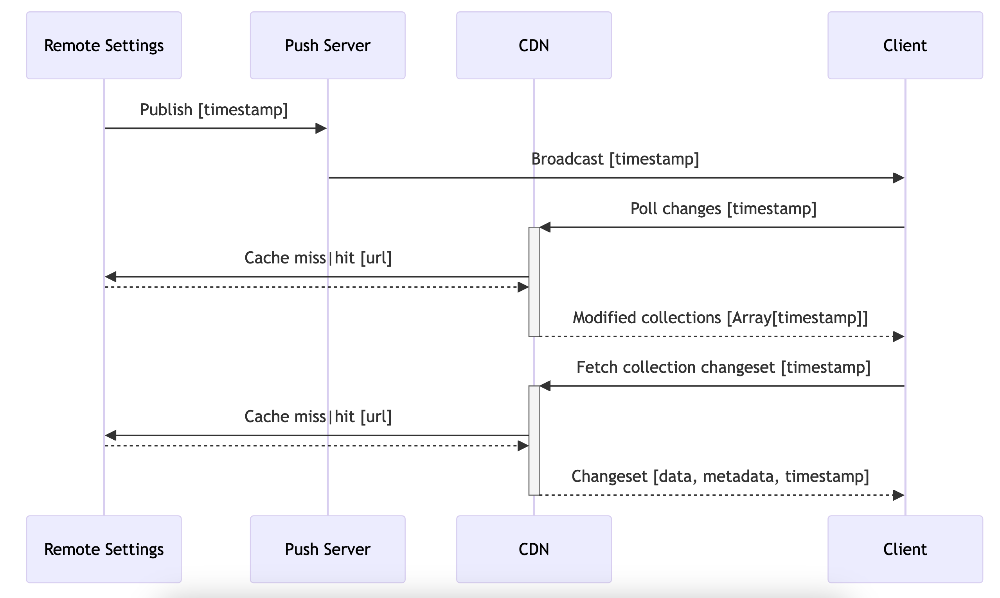
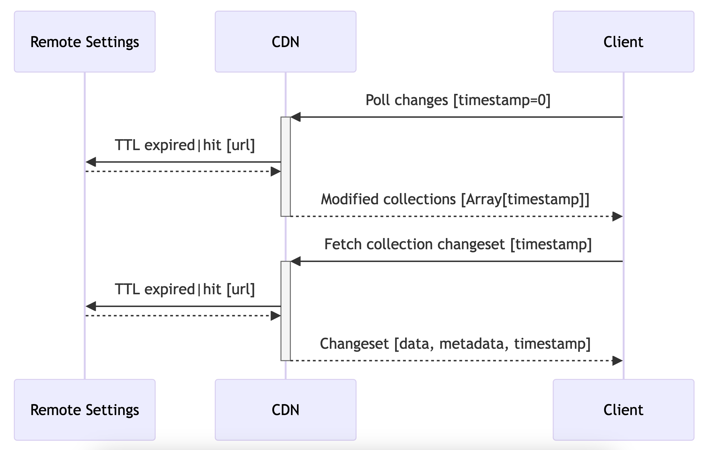
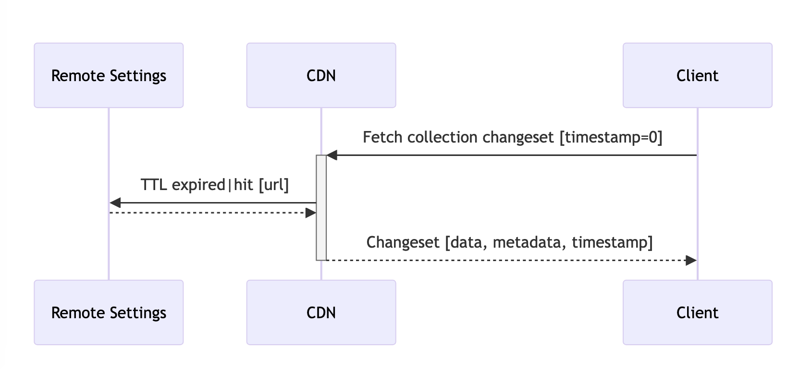
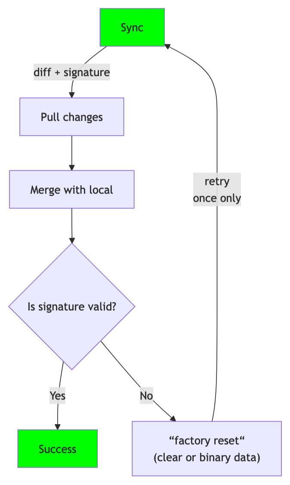

.. _client-specifications:

Client Specifications
=====================

Foreword
--------

For years, the sole and unique client was Gecko (the platform behind Firefox, Thunderbird..). In order to reach out new platforms and products, a fully-featured Rust client was built, using the application-services components (Viaduct, NSS, ...).
Despite our efforts to provide this fully featured, cross-platform client, new clients still emerged that obliged us to admit that our idea of having a single client of reference is dead.
Instead, we are going to provide specifications for Remote Settings clients, to at least mitigate the consequences of clients fragmentation.

That being said, we still **strongly discourage** the implementation of new ad-hoc clients.

We distinguish two major use-cases:

- authenticated write operations, ie. publish data;
- anonymous read operations, ie. fetch data from within our products.

Since the former does not take place on clients, it matters less than the latter, which has a major impact on traffic and our servers load.

Before launching your own implementation, please keep in consideration that:

* client fragmentation hinders our cohesive view of the service (from server to clients)
* heterogenous implementations slow down the roll out of API changes
* having multiple code bases for one service raises the cost of code review, maintenance, support, feature parity, security assurance
* the Remote Settings team has to be consulted to validate the implementation

Existing Clients
----------------

As of January 2025:

+------------------------+--------+--------------------------------------+---------------+----------+
|                        | Gecko  | application-services/remote-settings | kinto-http.py | kinto.js |
+========================+========+======================================+===============+==========+
| Write Operations       | ❌     | ❌                                   | ✅            | ✅       |
+------------------------+--------+--------------------------------------+---------------+----------+
| Add/Remove Attachments | ❌     | ❌                                   | ✅            | ✅       |
+------------------------+--------+--------------------------------------+---------------+----------+
| Approve/Reject reviews | ❌     | ❌                                   | ✅            | ❌       |
+------------------------+--------+--------------------------------------+---------------+----------+
| Changesets Endpoints   | ✅     | ✅                                   | ✅            | ❌       |
+------------------------+--------+--------------------------------------+---------------+----------+
| Cache Busting          | ✅     | ❌                                   | ✅            | ❌       |
+------------------------+--------+--------------------------------------+---------------+----------+
| Env Switching          | ✅     | ✅                                   | ❌            | ❌       |
+------------------------+--------+--------------------------------------+---------------+----------+
| Signature Verification | ✅     | ✅ Optional                          | ❌            | ❌       |
+------------------------+--------+--------------------------------------+---------------+----------+
| Local cache            | ✅     | ✅                                   | ❌            | ✅       |
+------------------------+--------+--------------------------------------+---------------+----------+
| Push notifications     | ✅     | ❌                                   | N/A           | N/A      |
+------------------------+--------+--------------------------------------+---------------+----------+
| Fetch Attachments      | ✅     | ✅ Without integrity check           | ✅            | ✅       |
+------------------------+--------+--------------------------------------+---------------+----------+
| Attachments bundles    | ✅     | ❌                                   | ❌            | ❌       |
+------------------------+--------+--------------------------------------+---------------+----------+
| JEXL support           | ✅     | ✅ Optional                          | N/A           | N/A      |
+------------------------+--------+--------------------------------------+---------------+----------+
| Packaged binary dumps  | ✅     | ✅                                   | N/A           | N/A      |
+------------------------+--------+--------------------------------------+---------------+----------+
| Uptake telemetry       | ✅     | ❌                                   | N/A           | N/A      |
+------------------------+--------+--------------------------------------+---------------+----------+
| Backoff                | ✅     | ✅                                   | ✅            | ✅       |
+------------------------+--------+--------------------------------------+---------------+----------+
| Deprecation            | ❌     | ❌                                   | ✅ Minimal    | ✅       |
+------------------------+--------+--------------------------------------+---------------+----------+
| Pagination             | ❌     | ❌                                   | ✅            | ✅       |
+------------------------+--------+--------------------------------------+---------------+----------+

Specifications
--------------

Remote Settings is a layer on top of the `Kinto API <https://docs.kinto-storage.org/en/stable/api/1.x/index.html#full-reference>`_. Although every read-only operation offered by the Kinto API is available on our Remote Settings server, clients must restrict the amount of distinct interactions. Millions of devices sending arbitrary requests could have a significant impact on infrastructure.

That's why clients developers MUST keep their implementation as close as possible to the existing ones, or at least get in touch with us if there is a solid reason to derive from it.

Endpoints
'''''''''

Clients MUST set their ``User-Agent`` request header, mentioning application name and version.

Clients SHOULD leverage Gzip transport using the ``Accept-Encoding: gzip`` request header.

The following two endpoints MUST be used to retrieve data. Clients MUST NOT use other endpoints.

**Fetch collection**:

``GET /v1/buckets/{bid}/collections/{cid}/changeset?_expected={timestamp}``.

Returns the following response for the collection ``{cid}`` in the bucket ``{bid}`` (likely ``main``):

- ``changes``: list of records, optionally filtered with ``?_since="{timestamp}"``
- ``metadata``: collection attributes
- ``timestamp``: records timestamp

.. note::

    The ``_expected={}`` querystring parameter is mandatory. Either you pass the current collection timestamp value obtained when polling for changes in order to bust the CDN cache, or you use a hard-coded value (eg. ``0``) and rely on the cache TTL. See section below about cache busting.

Examples:

* `get_changeset() in remote-settings-client <https://github.com/mozilla-services/remote-settings-client/blob/2538d6a07c28a3966b996d52596807df8c37130d/src/client/kinto_http.rs#L108-L128>`_
* `fetch_changeset() in Gecko <https://searchfox.org/mozilla-central/rev/c09764753ea40725eb50decad2c51edecbd33308/services/settings/RemoteSettingsClient.sys.mjs#1187-1209>`_

Clients SHOULD NOT rely on arbitrary server side filtering. In Remote Settings, collections are quite small anyway, and can usually be fetched entirely to be filtered on the client side. This helps us reduce our CDN cache cardinality.

Client MAY filter the list of changes to only obtain the changes since the last polling, using the ``?_since=`` querystring parameter. The value is a timestamp obtained from a previous changeset response.

For each collection, the amount of possible values for the timestamps is finite. Indeed, each timestamp value corresponds to the date and time of the data publication (reviewer approving changes on the server). Some collections change several times a day, but that still allows a lot of caching. The push notifications are debounced too, in case several users approve changes in a short amount of time.

**Poll for changes**:

``GET /v1/buckets/monitor/collections/changes/changeset?_expected={timestamp}``.

Returns the list of collections and their current timestamp.

- ``changes``: list of collections and their timestamp, optionally filtered with ``?_since="{timestamp}"``
- ``timestamp``: highest collections timestamp

.. note::

    The ``_expected={}`` querystring parameter is mandatory. Either you receive a Push notification from the server, and pass the timestamp value in order to bust the CDN cache, or you use a hard-coded value (eg. ``0``) and rely on the cache TTL. See section below about cache busting.

.. code-block:: JSON

    {
      "metadata": {},
      "timestamp": 1713532462683,
      "changes": [
        {
          "id": "19e79f22-62cf-92e1-c12c-a3b4b9cf51be",
          "last_modified": 1603126502200,
          "bucket": "blocklists",
          "collection": "plugins",
          "host": "firefox.settings.services.mozilla.com"
        },
        {
          "id": "b7f595f9-5fc5-d863-b5dd-e5425dcf427a",
          "last_modified": 1604940558744,
          "bucket": "blocklists",
          "collection": "addons",
          "host": "firefox.settings.services.mozilla.com"
        }
      ]
    }

Examples:

* `get_latest_change_timestamp() in remote-settings-client <https://github.com/mozilla-services/remote-settings-client/blob/2538d6a07c28a3966b996d52596807df8c37130d/src/client/kinto_http.rs#L79-L105>`_
* `fetchLatestChanges() in Gecko <https://searchfox.org/mozilla-central/rev/1f27a4022f9f1269d897526c1c892a57743e650c/services/settings/Utils.sys.mjs#376-457>`_

Server Error Responses
''''''''''''''''''''''

Every response is JSON.

If the HTTP status is not OK (>=400), the response contains a JSON mapping, with the following attributes:

- ``code``: matches the HTTP status code (e.g ``400``)
- ``errno``: stable application-level error number (e.g. ``109``)
- ``error``: string description of error type (e.g. ``"Bad request"``)
- ``message``: context information (e.g. ``"Invalid request parameters"``)
- ``info``: online resource (e.g. URL to error details)
- ``details``: additional details (e.g. list of validation errors)

**Example response**

.. code-block:: json

    {
      "code": 400,
      "errno": 107,
      "error": "Invalid parameters",
      "message": "_since in querystring: The value should be integer between double quotes.",
      "details": [
        {
          "location": "querystring",
          "name": "_since",
          "description": "The value should be integer between double quotes."
        }
      ]
    }

Cache Busting
'''''''''''''

**Using push notifications**

With push notification, we want the first requests to bust the CDN cache of the polling endpoint with the received value.

* The push notification payload contains the highest of all collections
* This timestamp is passed to the ``?_expected={}`` querystring param when polling for changes
* The polling endpoint will return the list of collections with their respective timestamps (`last_modified` field):
* Each collection can now be fetched using the timestamp obtained from the polling endpoint (eg. using the above example: ``/buckets/blocklists/plugins/changeset?_expected=1603126502200``)

.. https://mermaid-js.github.io/mermaid-live-editor/
.. sequenceDiagram
..     participant Remote Settings
..     participant Push Server
..     participant CDN
..     participant Client
..     Remote Settings->>Push Server: Publish [timestamp]
..     Push Server->>Client: Broadcast [timestamp]
..     Client->>+CDN: Poll changes [timestamp]
..     CDN->>Remote Settings: Cache miss|hit [url]
..     Remote Settings-->>CDN:
..     CDN-->>-Client: Modified collections [Array[timestamp]]
..     Client->>+CDN: Fetch collection changeset [timestamp]
..     CDN->>Remote Settings: Cache miss|hit [url]
..     Remote Settings-->>CDN:
..     CDN-->>-Client: Changeset [data, metadata, timestamp]

**Without push notifications (cached polling)**

Without push notification, we use hard-coded value  (``?_expected=0``) and rely on the cache TTL of the polling endpoint.
And use the timestamps obtained in the polling endpoint response as described above with push notifications.

.. https://mermaid-js.github.io/mermaid-live-editor/
.. sequenceDiagram
..     participant Remote Settings

..     participant CDN
..     participant Client

..     Client->>+CDN: Poll changes [timestamp=0]
..     CDN->>Remote Settings: TTL expired|hit [url]
..     Remote Settings-->>CDN:
..     CDN-->>-Client: Modified collections [Array[timestamp]]
..     Client->>+CDN: Fetch collection changeset [timestamp]
..     CDN->>Remote Settings: Cache miss|hit [url]
..     Remote Settings-->>CDN:
..     CDN-->>-Client: Changeset [data, metadata, timestamp]

**Without push notifications nor polling for changes (cached fetching)**

With this approach, we skip the step that poll for changes, and rely on the cache TTL for the collection data.

.. https://mermaid-js.github.io/mermaid-live-editor/
.. sequenceDiagram
..     participant Remote Settings

..     participant CDN
..     participant Client

..     Client->>+CDN: Fetch collection changeset [timestamp=0]
..     CDN->>Remote Settings: TTL expired|hit [url]
..     Remote Settings-->>CDN:
..     CDN-->>-Client: Changeset [data, metadata, timestamp]

.. note::

    As the service owners, we don't guarantee that we will keep the collection TTL under X hours.

Environment Switching
'''''''''''''''''''''

Clients MAY offer a convenient way to switch between DEV, STAGE, or PROD environments, in order to facilitate the work of QA teams.

Clients SHOULD use PROD by default. And for security reasons, there must be some protection in place to prevent users to switch environments.

Signature Verification
''''''''''''''''''''''

Clients SHOULD verify the integrity of the downloaded data.

Signature verification allows to guarantee:

- authenticity (+integrity) of data obtained from the server;
- that client local data was not tempered between two syncs.

.. note::

    Although Gecko on desktop is not exposed to the same risks as on mobile where applications and data are jailed, verifying signatures is a keystone in the chain of trust for data that we pull from remote servers.

.. https://mermaid-js.github.io/mermaid-live-editor/
.. graph TD
..     0[Sync] --> |diff + signature| pull;
..     pull[Pull changes] --> merge[Merge with local]
..     merge --> valid{Is signature valid?};
..     valid -->|Yes| Success;
..     valid -->|No| clear[“factory reset“  #40;clear or binary data#41;];
..     clear --> retry{Already retried?};
..     retry --> |No| 0;
..     retry --> |Yes| Failure;
..     style 0 fill:#00ff00;
..     style Success fill:#00ff00;
..     style Failure fill:#ff0000;

Signature validation steps are:

- Download the certificates chain provided from the ``x5u`` URL in metadata, and parse the PEM bytes as DER-encoded X.509 Certificate
- Verify the certificates chain:

  1. each certificate must be valid at the current date
  2. each child signature must match its parent's public key for each pair in the chain
  3. root certificate must match hard-coded value

- Verify that the subject alternate name of the chain's end-entity (leaf) certificate matches the ``signer_id`` provided in metadata
- Use the chain's end-entity (leaf) certificate to verify that the "signature" value provided in metadata matches the contents of the local data:

  1. Serialize the local data ``{"data": records_sorted_by_id, "last_modified": timestamp}`` using `Canonical JSON <https://github.com/mozilla-services/canonicaljson-rs>`_
  2. The message to verify is the concatenation of ``Content-Signature:\x00 + serialized_data``
  3. Decode the base64 ``signature`` string provided in metadata (using URL safe)
  4. Verify using the leaf certificate public key that the message matches the decoded signature using the `ECDSA_P384_SHA384_FIXED` algorithm

Examples with 3rd party crypto library:

- `In Rust from scratch using Ring <https://github.com/mozilla-services/remote-settings-client/blob/2538d6a07c28a3966b996d52596807df8c37130d/src/client/signatures/ring_verifier.rs#L19-L136>`_
- `In Python, using cryptography <https://github.com/mozilla-services/python-autograph-utils/blob/95ddfddb39f25b8c9661deafb2cea4f9f71c66f1/src/autograph_utils/__init__.py#L279-L320>`_

Clients embedded in products SHOULD use NSS (true in ~2023), and its high level API for signature verification.

Examples with Mozilla NSS:

- `_validateCollectionSignature() in Gecko client <https://searchfox.org/mozilla-central/rev/058ab60e5020d7c5c98cf82d298aa84626e0cd79/services/settings/RemoteSettingsClient.sys.mjs#994-1022>`_
- `Verification Trait in Remote Settings client <https://github.com/mozilla-services/remote-settings-client/blob/2538d6a07c28a3966b996d52596807df8c37130d/src/client/signatures/rc_crypto_verifier.rs#L14-L33>`_

Local State
'''''''''''

Clients MAY have a local state and copy of the data, in order to limit the amount of data to fetch from the server.

The local state SHOULD contain the timestamp of the last successful fetch, to be provided in the ``?_since=`` filter on the next call. The deleted records are then returned in the form of *tombstones* (``{"id": "xyz", "deleted": true}``), which MUST be removed from local copy. Created and updated records are returned in the same form and MUST be upserted in local copy.

Examples:

- `importChanges() in Gecko <https://searchfox.org/mozilla-central/rev/d23849dd6d83edbe681d3b4828700256ea34a654/services/settings/Database.sys.mjs#79-161>`_
- `merge_changes() in Remote Settings client <https://github.com/mozilla-services/remote-settings-client/blob/2538d6a07c28a3966b996d52596807df8c37130d/src/client.rs#L832-L849>`_

Attachments
'''''''''''

The attachments base URL is obtained on the root URL of the server:

``GET /v1/``

Returns the metadata of the server.

- ``capabilities.attachments.base_url``: the base URL for attachments with a trailing ``/``

Records with an attachment have the necessary metadata to download and verify it.

- ``attachment.location``: path to the attachment, to be concatenated with the ``base_url``
- ``attachment.hash``: SHA-256 of the file
- ``attachment.size``: size of the file in bytes

Clients SHOULD verify the size and hash of their downloaded copy in order to implement our security model and guarantee integrity and authenticity of CDN content.

Examples:

* `fetch_attachment() in remote-settings-client <https://github.com/mozilla-services/remote-settings-client/blob/2538d6a07c28a3966b996d52596807df8c37130d/src/client.rs#L645-L718>`_
* `fetchAttachment() in Gecko <https://searchfox.org/mozilla-central/rev/1f27a4022f9f1269d897526c1c892a57743e650c/services/settings/Attachments.sys.mjs#198-314>`_

Attachments bundles
'''''''''''''''''''

For collections where attachments bundling is enabled, the clients can download a Zip bundle:

``GET {{ attachments.base_url }}/bundles/{{ bucket }}--{{ collection }}.zip``

It returns a Zip with the attachment files and their metadata, and can be used to fill the local attachment cache using a single network request.

Filenames are:

- ``{record[id]}`` for the attachment binary data
- ``{record[id]}.meta.json`` for the metadata

.. note::

    In order to avoid facing a 404 when pulling the bundle, and know in advance whether a collection has a bundle available,
    check the ``attachment.bundle`` field in the collection ``metadata`` (eg. from the changeset endpoint).

    .. code-block::

        $ curl -s "$SERVER/buckets/security-state/collections/intermediates/changeset?_expected=0" | jq .metadata.attachment.bundle
        true

Examples:

* `cacheAll() in Gecko <https://searchfox.org/mozilla-central/rev/e968519d806b140c402c3b3932cd5f6cd7cc42ac/services/settings/Attachments.sys.mjs#181-273>`_

Push Notifications
''''''''''''''''''

Clients MAY listen to push notifications from and initiate synchronizations when a payload is received.

The broadcast ID is ``"remote-settings/monitor_changes"`` and the PROD server ``wss://push.services.mozilla.com``.

The payload contains the highest timestamp of all collections as quoted string (ie. ETag). See the *Cache busting* section on how to use the received timestamp.

Examples:

* `Push timestamp Telescope check in Python <https://github.com/mozilla-services/telescope/blob/364f3c6865e56e6c3914cc4139ba977de4bcb03f/checks/remotesettings/push_timestamp.py#L27-L40>`_

Uptake Telemetry
''''''''''''''''

Clients MAY report the status of the synchronization:

- ``up-to-date``
- ``success``
- ``error``

See additional statuses in `Desktop clients <https://searchfox.org/mozilla-central/rev/45d6f8bf028e049f812aa26dced565d50068af5d/services/common/uptake-telemetry.sys.mjs#76-108>`_.

Clients MAY report synchronization status for the following sources:

- ``"settings-sync"``: as a global synchronization status
- ``"settings-changes-monitoring"``: for polling from ``monitor/changes``
- ``{bucket}/{id}``: for the synchronization of a single collection

Clients MAY attach additional information like:

- ``duration``: duration of synchronization in milliseconds
- ``timestamp``: current timestamp value
- ``trigger``: what triggered the synchronization (``startup``, ``timer``, ``broadcast``, ``manual``)
- ``errorName``: an error identifier, such as the exception class name

Backoff Headers
'''''''''''''''

As owners of the backend, we want to be able to tell clients to gently delay their hits on the server.

Client MUST honour the wait interval in seconds set in the ``Backoff`` response headers.

Examples:

* `ensure_no_backoff() in application-services/remote-settings <https://github.com/mozilla/application-services/blob/94d15144656f2fa49e3de385bb1ec07da446d6e4/components/remote_settings/src/client.rs#L171-L186>`_
* `pollChanges() in Gecko <https://searchfox.org/mozilla-central/rev/058ab60e5020d7c5c98cf82d298aa84626e0cd79/services/settings/Utils.sys.mjs#443-448>`_

Deprecation Headers
'''''''''''''''''''

Client SHOULD react on deprecation headers. Ideally make it visible to the final users that the version of their product is relying on a service that is going away.

When enabled, the server sends a ``Alert`` header with a JSON serialized value, that contains extra-information (eg. ``message``, ``url``).

Examples:

* `_checkForDeprecationHeader() in kinto.js <https://github.com/Kinto/kinto.js/blob/b285f258b08c2a5e0650289bb47f7b612af149bd/src/http/http.ts#L216-L232>`_

Documentation:

* `API Docs <https://docs.kinto-storage.org/en/stable/api/1.x/deprecation.html>`_
