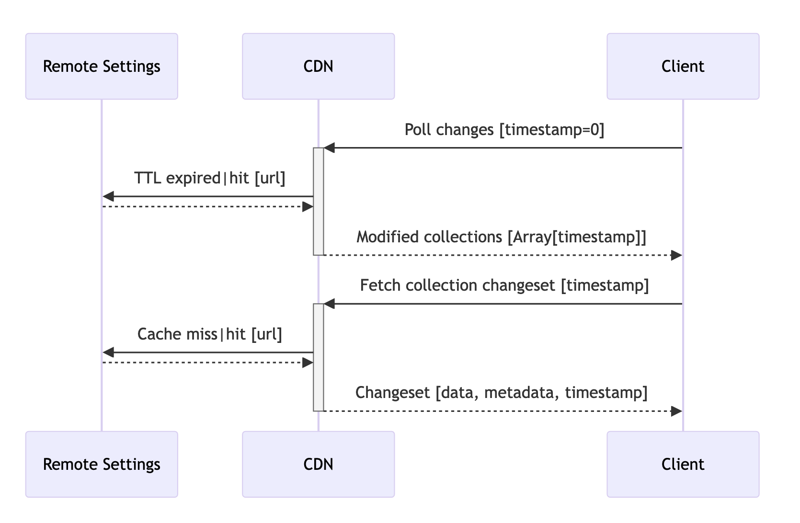

.. _client-specifications:

Client Specifications
=====================

Foreword
--------

For years, the sole and unique client was Gecko (the platform behind Firefox, Thunderbird..). In order to reach out new platforms and products, a fully-featured Rust client was built, using the application-services components (Viaduct, NSS, ...).
Despite our efforts to provide this fully featured, cross-platform client, new clients still emerged that obliged us to admit that our idea of having a single client of reference is dead.
Instead, we are going to provide specifications for Remote Settings clients, to at least mitigate the consequences of clients fragmentation.

That being said, we still **strongly discourage** the implementation of ad-hoc clients.

We distinguish two major use-cases:

- authenticated write operations, ie. publish data;
- anonymous read operations, ie. fetch data from within our products.

Since the former does not take place on clients, it matters less than the latter, which has a major impact on traffic and our servers load.

Existing Clients
----------------

+------------------------+-------+-------------+--------------------------------------+---------------+----------+
|                        | Gecko | Rust Client | application-services/remote-settings | kinto-http.py | kinto.js |
+========================+=======+=============+======================================+===============+==========+
| Write Operations       | ❌    | ✅          | ❌                                   | ✅            | ✅       |
| Add/Remove Attachments | ❌    | ✅          | ❌                                   | ❌            | ✅       |
| Approve/Reject reviews | ❌    | ✅          | ❌                                   | ❌            | ❌       |
+------------------------+-------+-------------+--------------------------------------+---------------+----------+
| Changesets Endpoints   | ✅    | ✅          | ❌                                   | ✅            | ❌       |
| Cache Busting          | ✅    | ✅          | ❌                                   | ✅            | ❌       |
| Env Switching          | ✅    | ~ Partial   | ✅                                   | ❌            | ❌       |
| Signature Verification | ✅    | ✅ Optional | ❌                                   | ❌            | ❌       |
| Local State            | ✅    | ✅ Optional | ❌                                   | ❌            | ✅       |
| Fetch Attachments      | ✅    | ✅          | ✅ Without integrity check           | ❌            | ✅       |
| Backoff                | ✅    | ✅          | ✅                                   | ✅            | ✅       |
| Deprecation            | ❌    | ❌          | ❌                                   | ✅ Minimal    | ✅       |
+------------------------+-------+-------------+--------------------------------------+---------------+----------+

Specifications
--------------

Remote Settings is a layer on top of the Kinto API. Although every read-only operation offered by the Kinto API is available on our Remote Settings server, clients must restrict the amount of distinct interactions. Millions of devices sending arbitrary requests could have a significant impact on infrastructure.

That's why clients developers MUST keep their implementation as close as possible to the existing ones, or at least get in touch with us if there is a solid reason to derive from it.

Endpoints
'''''''''

Clients MUST set their ``User-Agent`` request header, mentioning application name and version.

Clients SHOULD leverage Gzip transport using the ``Accept-Encoding: gzip`` request header.

The following two endpoints MUST be used to retrieve data. Clients SHOULD NOT use other endpoints.

**Fetch collection**:

``GET /v1/buckets/{bid}/collections/{cid}/changeset?_expected={timestamp}``.

Returns the following response for the collection ``{cid}`` in the bucket ``{bid}`` (likely ``main``):

- ``changes``: list of records, optionally filtered with ``?_since="{timestamp}"``
- ``metadata``: collection attributes
- ``timestamp``: records timestamp

.. note::

    The ``_expected={}`` querystring parameter is mandatory but can be set to ``0`` if unknown. See section below about cache busting.

Examples:

* `get_changeset() in remote-settings-client <https://github.com/mozilla-services/remote-settings-client/blob/2538d6a07c28a3966b996d52596807df8c37130d/src/client/kinto_http.rs#L108-L128>`_
* `fetch_changeset() in Gecko <https://searchfox.org/mozilla-central/rev/c09764753ea40725eb50decad2c51edecbd33308/services/settings/RemoteSettingsClient.sys.mjs#1187-1209>`_

Clients SHOULD NOT rely on arbitrary server side filtering. In Remote Settings, collections are quite small anyway, and can usually be fetched entirely to be filtered on the client side. This helps us reduce our CDN cache cardinality.

**Poll for changes**:

``GET /v1/buckets/monitor/collections/changes/changeset?_expected={timestamp}``.

Returns the list of collections and their current timestamp.

- ``changes``: list of collections and their timestamp, optionally filtered with ``?_since="{timestamp}"``
- ``tiemstamp``: highest collections timestamp

.. note::

    The ``_expected={}`` querystring parameter is mandatory but can be set to ``0`` if unknown. See next section about cache busting.

Examples:

* `get_latest_change_timestamp() in remote-settings-client <https://github.com/mozilla-services/remote-settings-client/blob/2538d6a07c28a3966b996d52596807df8c37130d/src/client/kinto_http.rs#L79-L105>`
* `fetchLatestChanges() in Gecko <https://searchfox.org/mozilla-central/rev/1f27a4022f9f1269d897526c1c892a57743e650c/services/settings/Utils.sys.mjs#376-457>`_

Cache Busting
'''''''''''''

Using push notifications:

.. image:: images/client-specifications-cache-bust.png

.. https://mermaid-js.github.io/mermaid-live-editor/
.. sequenceDiagram
..     participant Remote Settings
..     participant Push Server
..     participant CDN
..     participant Client
..     Remote Settings->>Push Server: Publish [timestamp]
..     Push Server->>Client: Broadcast [timestamp]
..     Client->>+CDN: Poll changes [timestamp]
..     CDN->>Remote Settings: Cache miss|hit [url]
..     Remote Settings-->>CDN:
..     CDN-->>-Client: Modified collections [Array[timestamp]]
..     Client->>+CDN: Fetch collection changeset [timestamp]
..     CDN->>Remote Settings: Cache miss|hit [url]
..     Remote Settings-->>CDN:
..     CDN-->>-Client: Changeset [data, metadata, timestamp]

Without push notifications:

.. https://mermaid-js.github.io/mermaid-live-editor/
.. sequenceDiagram
..     participant Remote Settings

..     participant CDN
..     participant Client

..     Client->>+CDN: Poll changes [timestamp=0]
..     CDN->>Remote Settings: TTL expired|hit [url]
..     Remote Settings-->>CDN:
..     CDN-->>-Client: Modified collections [Array[timestamp]]
..     Client->>+CDN: Fetch collection changeset [timestamp]
..     CDN->>Remote Settings: TTL expired|hit [url]
..     Remote Settings-->>CDN:
..     CDN-->>-Client: Changeset [data, metadata, timestamp]

Environment Switching
'''''''''''''''''''''

Clients MAY offer a convenient way to switch between DEV, STAGE, or PROD environments, in order to facilitate the work of QA teams.

Clients SHOULD use PROD by default. And for security reasons, there must be some protection in place to prevent users to switch environments.

Signature Verification
''''''''''''''''''''''

Clients SHOULD verify the integrity of the downloaded data.

.. note::

    Although Gecko on desktop is not exposed to the same risks as on mobile where applications and data are jailed, verifying signatures is a keystone in the chain of trust for data. It is the only way to guarantee the authenticity (and/or integrity) of the data.

Signature validation steps are:

- Download the certificates chain provided in metadata
- Verify the certificates chain: each certificate must be valid, and the SHA-256 root hash of the root certificate should match one of the hardcoded values at build time.
- Serialize the downloaded data using Canonical JSON
- Verification that the signature provided in metadata matches the one computed on downloaded data

Examples:

- `In Rust from scratch using Ring <https://github.com/mozilla-services/remote-settings-client/blob/2538d6a07c28a3966b996d52596807df8c37130d/src/client/signatures/ring_verifier.rs#L19-L136>`_
- `In Python, using cryptography <https://github.com/mozilla-services/python-autograph-utils/blob/95ddfddb39f25b8c9661deafb2cea4f9f71c66f1/src/autograph_utils/__init__.py#L279-L320>_`

Clients embedded in products SHOULD use NSS (true in ~2023), and its high level API for signature verification.

Examples:

- `_validateCollectionSignature() in Gecko client <https://searchfox.org/mozilla-central/rev/058ab60e5020d7c5c98cf82d298aa84626e0cd79/services/settings/RemoteSettingsClient.sys.mjs#994-1022>`_
- `Verification Trait in Remote Settings client <https://github.com/mozilla-services/remote-settings-client/blob/2538d6a07c28a3966b996d52596807df8c37130d/src/client/signatures/rc_crypto_verifier.rs#L14-L33>`_

Local State
'''''''''''

Clients MAY have a local state and copy of the data, in order to limit the amount of data to fetch from the server.

The local state SHOULD contain the timestamp of the last successful fetch, to be provided in the ``?_since=`` filter on the next call. The deleted records are then returned in the form of *tombstones* (``{"id": "xyz", "deleted": true}``), which MUST be removed from local copy. Created and updated records are returned in the same form and MUST be upserted in local copy.

Examples:

- `importChanges() in Gecko <https://searchfox.org/mozilla-central/rev/d23849dd6d83edbe681d3b4828700256ea34a654/services/settings/Database.sys.mjs#79-161>`_
- `merge_changes() in Remote Settings client <https://github.com/mozilla-services/remote-settings-client/blob/2538d6a07c28a3966b996d52596807df8c37130d/src/client.rs#L832-L849>`_

Attachments
'''''''''''

The attachments base URL is obtained on the root URL of the server:

``GET /v1/``

Returns the metadata of the server.

- ``capabilities.attachments.base_url``: the base URL for attachments with a trailing ``/``

Records with an attachment have the necessary metadata to download and verify it.

- ``attachment.location``: path to the attachment, to be concatenated with the ``base_url``
- ``attachment.hash``: SHA-256 of the file
- ``attachment.size``: size of the file in bytes

Clients SHOULD verify the size and hash of their downloaded copy in order to implement our security model and guarantee integrity and authenticity of CDN content.

Examples:

* `fetch_attachment() in remote-settings-client <https://github.com/mozilla-services/remote-settings-client/blob/2538d6a07c28a3966b996d52596807df8c37130d/src/client.rs#L645-L718>`_
* `fetchAttachment() in Gecko <https://searchfox.org/mozilla-central/rev/1f27a4022f9f1269d897526c1c892a57743e650c/services/settings/Attachments.sys.mjs#198-314>`_

Backoff Headers
'''''''''''''''

As owners of the backend, we want to be able to tell clients to gently delay their hits on the server.

Client MUST honour the wait interval in seconds set in the ``Backoff`` response headers.

Examples:

* `ensure_no_backoff() in application-services/remote-settings <https://github.com/mozilla/application-services/blob/94d15144656f2fa49e3de385bb1ec07da446d6e4/components/remote_settings/src/client.rs#L171-L186>`_
* `pollChanges() in Gecko <https://searchfox.org/mozilla-central/rev/058ab60e5020d7c5c98cf82d298aa84626e0cd79/services/settings/Utils.sys.mjs#443-448>`_

Deprecation Headers
'''''''''''''''''''

Client SHOULD react on deprecation headers. Ideally make it visible to the final users that the version of their product is relying on a service that is going away.

When enabled, the server sends a ``Alert`` header with a JSON serialized value, that contains extra-information (eg. ``message``, ``url``).

Examples:

* `_checkForDeprecationHeader() in kinto.js <https://github.com/Kinto/kinto.js/blob/b285f258b08c2a5e0650289bb47f7b612af149bd/src/http/http.ts#L216-L232>`_

Documentation:

* `API Docs <https://docs.kinto-storage.org/en/stable/api/1.x/deprecation.html>`_
