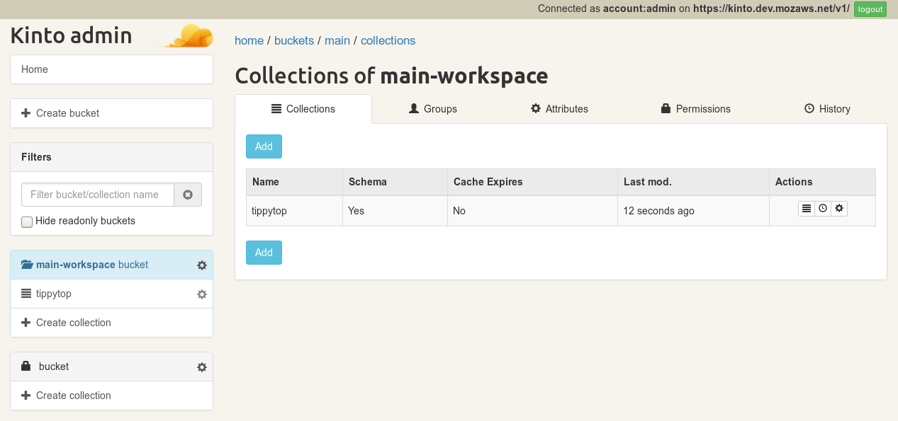
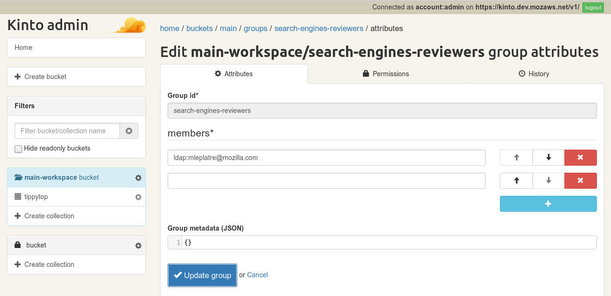

.. _getting-started:

Getting Started
===============

We will help you to use Remote Settings in your application!

.. _go-to-prod:

Create a new official type of Remote Settings
---------------------------------------------

Basically, you will have to go through these 3 steps:

1. Setup the `Mozilla VPN <https://mana.mozilla.org/wiki/display/IT/Mozilla+VPN>`_ and request access to the server using `this Bugzilla template <https://bugzilla.mozilla.org/enter_bug.cgi?assigned_to=vpn-acl%40infra-ops.bugs&bug_file_loc=http%3A%2F%2F&bug_ignored=0&bug_severity=normal&bug_status=NEW&cc=mathieu%40mozilla.com&cc=eglassercamp%40mozilla.com&cf_fx_iteration=---&cf_fx_points=---&comment=Hello%2C%0D%0ACould%20you%20please%20me%20%28LDAP%20user%40mozilla.com%29%20o%20get%20VPN%20access%20to%20get%20access%20to%20Remote%20Settings%3F%0D%0AThe%20VPN%20group%20is%20%22vpn_kinto1_stage%22.%0D%0AThanks%21&component=Mozilla%20VPN%3A%20ACL%20requests&contenttypemethod=list&contenttypeselection=text%2Fplain&defined_groups=1&flag_type-4=X&flag_type-481=X&flag_type-607=X&flag_type-674=X&flag_type-800=X&flag_type-803=X&form_name=enter_bug&groups=mozilla-employee-confidential&maketemplate=Remember%20values%20as%20bookmarkable%20template&op_sys=Unspecified&priority=--&product=Infrastructure%20%26%20Operations&qa_contact=gcox%40mozilla.com&rep_platform=Unspecified&short_desc=VPN%20access%20for%20https%3A%2F%2Fsettings-writer.prod.mozaws.net&target_milestone=---&version=Production>`_
2. Design your data model (see below) and prepare the list of colleagues that will be allowed to review your data
3. Request the creation of your collection using `this Bugzilla ticket template <https://bugzilla.mozilla.org/enter_bug.cgi?assigned_to=wezhou%40mozilla.com&bug_file_loc=http%3A%2F%2F&bug_ignored=0&bug_severity=normal&bug_status=NEW&cc=mathieu%40mozilla.com&cf_fx_iteration=---&cf_fx_points=---&cf_status_firefox62=---&cf_status_firefox63=---&cf_status_firefox64=---&cf_status_firefox_esr60=---&cf_status_geckoview62=---&cf_tracking_firefox62=---&cf_tracking_firefox63=---&cf_tracking_firefox64=---&cf_tracking_firefox_esr60=---&cf_tracking_firefox_relnote=---&cf_tracking_geckoview62=---&comment=Collection%20name%3A%20_____%20%28eg.%20fingerprint-fonts%2C%20focus-experiments%2C%20...%29%0D%0A%0D%0AList%20of%20LDAP%20emails%20allowed%20to%20change%20the%20records%20%28editors%29%3A%0D%0A%20-%20user1%40mozilla.com%0D%0A%20-%20...%0D%0A%0D%0AList%20of%20LDAP%20emails%20allowed%20to%20approve%20the%20changes%20%28reviewers%29%0D%0A%20-%20user1%40mozilla.com%0D%0A%20-%20...%0D%0A%0D%0A%0D%0A%28optional%29%20Allow%20file%20attachments%20on%20records%3A%20%28yes%2Fno%29%0D%0A%28optional%29%20Are%20attachments%20required%20on%20records%20%28yes%2Fno%29%0D%0A%28optional%29%20List%20of%20fields%20names%20to%20display%20as%20columns%20in%20the%20records%20list%20UI%3A%20%28eg.%20%22name%22%2C%20%22details.size%22%29%0D%0A%28optional%29%20JSON%20schema%20to%20validate%20records%20%28in%20YAML%20format%29%3A%20%28eg.%20https%3A%2F%2Fgist.github.com%2Fleplatrem%2F4d86d5a64a56b5d8990be9af592d0e7f%29%0D%0A&component=Server%3A%20Remote%20Settings&contenttypemethod=list&contenttypeselection=text%2Fplain&defined_groups=1&flag_type-37=X&flag_type-5=X&flag_type-607=X&flag_type-708=X&flag_type-721=X&flag_type-737=X&flag_type-748=X&flag_type-787=X&flag_type-800=X&flag_type-803=X&flag_type-846=X&flag_type-864=X&flag_type-929=X&flag_type-933=X&form_name=enter_bug&groups=mozilla-employee-confidential&maketemplate=Remember%20values%20as%20bookmarkable%20template&op_sys=Unspecified&priority=--&product=Cloud%20Services&rep_platform=Unspecified&short_desc=Please%20create%20the%20new%20collection%20%22_____%22&target_milestone=---&version=unspecified>`_

Once done, you will be able to login and edit your records on the **PROD** Admin UI: https://settings-writer.prod.mozaws.net/v1/admin/

Don't hesitate to contact us (``#storage`` on IRC) if you're stuck or have questions about the process!

Check out the :ref:`screencast to create, request review and approve changes <screencasts-modify-request-review>`, or :ref:`our FAQ <faq>`!

.. note::

    If you simply want to play with the stack or the API, the best way to get started is probably to use our :ref:`DEV server <tutorial-dev-server>`, since everyone is allowed to manipulate data on the server and the multi-signoff workflow is not enabled. Check out the :ref:`dedicated tutorial <tutorial-dev-server>`!

About your data
---------------

Name your collection in lowercase with dashes (eg. ``public-list-suffix``, `examples  <https://settings.prod.mozaws.net/v1/buckets/main/collections?_fields=id>`_).

The Admin UI automatically builds forms based on some metadata for your collection, namely:

- the list of fields to be displayed as the list columns (eg. ``title``, ``comment.author``)
- a JSON schema that will be render as a form to create and edit your records  (`see example <https://bugzilla.mozilla.org/show_bug.cgi?id=1500868>`_)
- whether you want to control the ID field or let the server assign it automatically
- whether you want to be able to attach files on records

.. note::

    If your client code expects to find 0 or 1 record by looking up on a specific field, you should probably use that field as the record ID. ``RemoteSettings("cid").get({filters: {id: "a-value"}})`` will be instantaneous.

It is recommended to keep your Remote Settings records small, especially if you update them often. If you have big amounts of data to publish via Remote Settings, use our :ref:`file attachments feature <tutorial-attachments>` instead.

By default, all records are made available to all users. If you want to control which users should have a particular entry, you can add a ``filter_expression`` field (see :ref:`target filters <target-filters>`).

Self service in STAGE
---------------------

In STAGE, every staff member is allowed to create new collections. It can be handy to test the client code with a real server, including review, content signature etc.

In Kinto terms, creating a new type of Remote Settings consists in creating a new collection in the ``main-workspace`` bucket.

1. Connect to the Mozilla VPN
2. Login to the STAGE Admin UI at https://settings-writer.stage.mozaws.net/v1/admin/
3. Go create your new collection in the *Collections* tab of the ``main-workspace`` bucket:

When a collection is created, the ``{collection-name}-editors`` and ``{collection-name}-reviewers`` groups are automatically created. The user (you!) that created the collection is automatically added as a member of those two groups.

But since users cannot signoff their own changes, you must add at least one collaborator to the ``{collection-name}-reviewers`` group. This comrade will have to approve the data changes made by the members of the editors group (you).

In the Admin UI, add this new member (with format ``ldap:{email}``) to the appropriate group(s) in the *Groups* tab of the ``main-workspace`` bucket.

.. seealso::

    Our `Remote Settings DevTools <https://github.com/mozilla/remote-settings-devtools>`_ will allow you to switch the source between PROD/STAGE.
